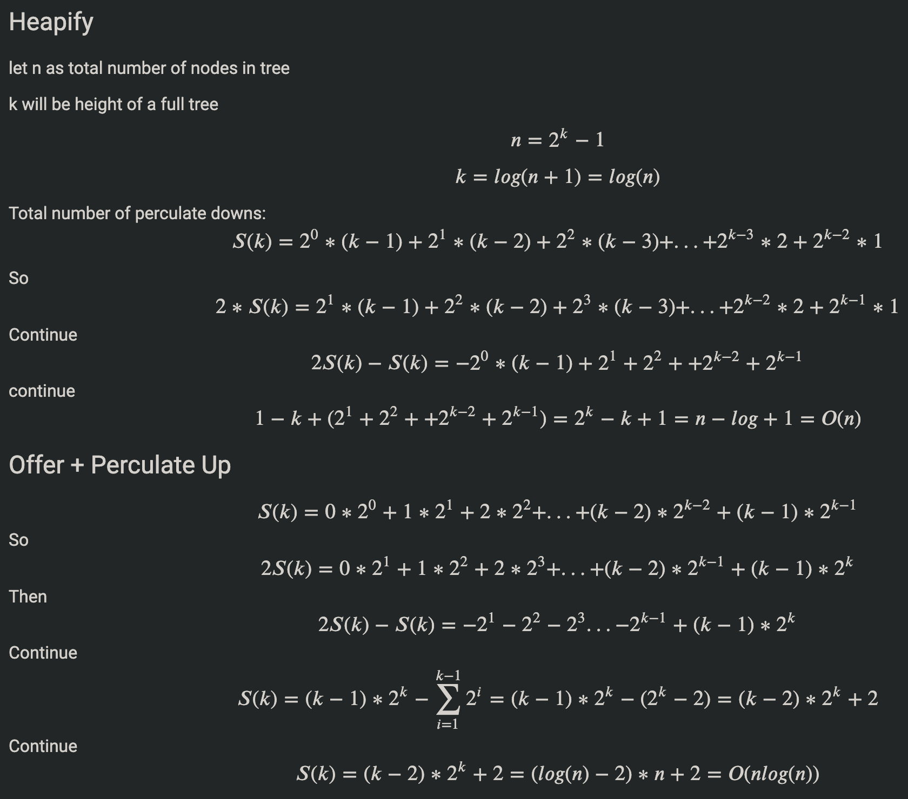
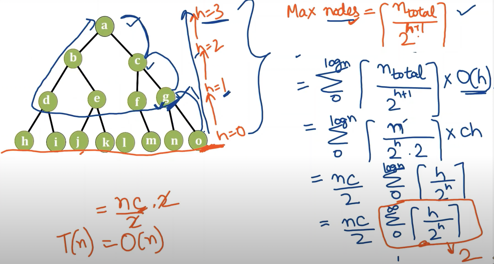

# Description
Find the K-smallest numbers in an unsorted integer array A. The returned numbers should be in **ascending order**.

## Assumptions
A is not null
K is >= 0 and smaller than or equal to size of A
Return
an array with size K containing the K-smallest numbers in ascending order
Examples

A = {3, 4, 1, 2, 5}, K = 3, the 3 smallest numbers are {1, 2, 3}

### What is the time complexity of heapify?

[Why Complexity of Build Heap is O(n) ?](https://www.youtube.com/watch?v=rBRItn-P6n4)


# Solution 0: sort
Sort the array first, then return the first k elements.

### Time Complexity
O(nlogn)

### Space Complexity
O(1)

```java
public class Solution {
  public int[] kSmallest(int[] a, int k) {
    Arrays.sort(a);
    return Arrays.copyOf(a, k);
  }
}
```

# Solution 1: minHeap
Heapify the whole array as minHeap, poll k elements out

### Time Complexity
O(C\*n + k\*log(n))

Heapify: O(C*n)

poll: O(k*log(n))

### Space Complexity
O(1) ~ O(n)

Heapify manually: O(1) (You normally don't want to do this...)

Heapify using priority queue constructor: O(n)

PriorityQueue constructor needs to make a copy of the data you provide, and it takes a collection (say List<Integer>) not an array, so you have to take time and space to convert your array to a collection.

```java

public class Solution {

    public static List<Integer> toList(int[] a) {
        List<Integer> list = new ArrayList<>();
        for (int val : a) list.add(val);
        return list;
    }

    // TC: O(n + k*log(n)) SC: O(n)
    public int[] kSmallest(int[] a, int k) {
        int[] res = new int[k];
        PriorityQueue<Integer> pq = new PriorityQueue<>(toList(a));
        for (int i = 0; i < k; i++) res[i] = pq.poll();
        return res;
    }
}

```

# Solution 2: maxHeap
maxHeap meaning: **<span style="color:#30c9e8">solution so far</span>.**

offer first k elements into minHeap, then compare all rest n - k elements with maxHeap.peek(), replace maxHeap.peek() with smaller.

poll k elements out and fill a result array backwards

### Time Complexity
offer 1st k: C*k (Heapify)

poll and offer rest n - k: 2 * (n - k) * log(k)

poll last k: k * log(k)

Add them together:
C*k + (2n - k) * log(k)

### Space Complexity
O(k)

```java
public class Solution {
  public int[] kSmallest(int[] a, int k) {
    if (k == 0) return new int[0];
    // use Collections.reverseOrder() to create maxHeap
    PriorityQueue<Integer> pq = new PriorityQueue<>(k, Collections.reverseOrder());
    int[] res = new int[k];

    for (int i = 0; i < a.length; i++)
      if (i < k) pq.offer(a[i]); // offer first k elements into maxHeap
      else if (pq.peek() > a[i]) { // maxHeap will always keep k-smallest elements so far
          pq.poll();
          pq.offer(a[i]);
        }

    while (--k >= 0) res[k] = pq.poll(); // fill result array backwards

    return res;
  }
}
```

# Time Complexity: Solution 1 vs 2
| k vs n    | Solution 1         | Solution 2                |
|-----------|--------------------|---------------------------|
| TC        | C\*n + k*log(n)    | C*k + 2(n - k)*log(k)     |
| k << n    | C*n                | 2*log(k)*n                |
| k ~ n     | (C + log(n))*n     | C*n (Better?)             |
| k = n / 2 | (C + 0.5*log(n))*n | (0.5 + log(n))*n(better?) |

Can't really say, not sure why am I spending so much time on this!?

# Space Complexity: Solution 1 vs 2
as k <= n, Solution 2 will have equal or better space consumption.

# Solution 3: quickSelect

### Time Complexity
O(n) + O(k*log(k))

worst: O(n^2) + O(k*log(k))

### Space Complexity
O(log(n)) (height of recursion tree)

worst: O(n)

```java
public class Solution {
  public int[] kSmallest(int[] a, int k) {
    quickSelect(a, 0, a.length - 1, k - 1);
    int[] res = Arrays.copyOf(a, k);
    Arrays.sort(res);
    return res;
  }

  private void quickSelect(int[] a, int l, int r, int k) {
    if (l >= r) return;
    int p = partition(a, l, r); // p: pivot index
    if (p < k) quickSelect(a, p + 1, r, k);
    if (p > k) quickSelect(a, l, p - 1, k);
  }

  private int partition(int[] a, int l, int r) {
    int i = l, j = r - 1; // use r as pivot for simplicity
    while (i <= j) {
      if (a[i] < a[r]) i++;
      else if (a[j] >= a[r]) j--;
      else swap(a, i++, j--);
    }
    swap(a, i, r);
    return i;
  }

  private void swap(int[] a, int i, int j) {
    int tmp = a[i];
    a[i] = a[j];
    a[j] = tmp;
  }
}
```