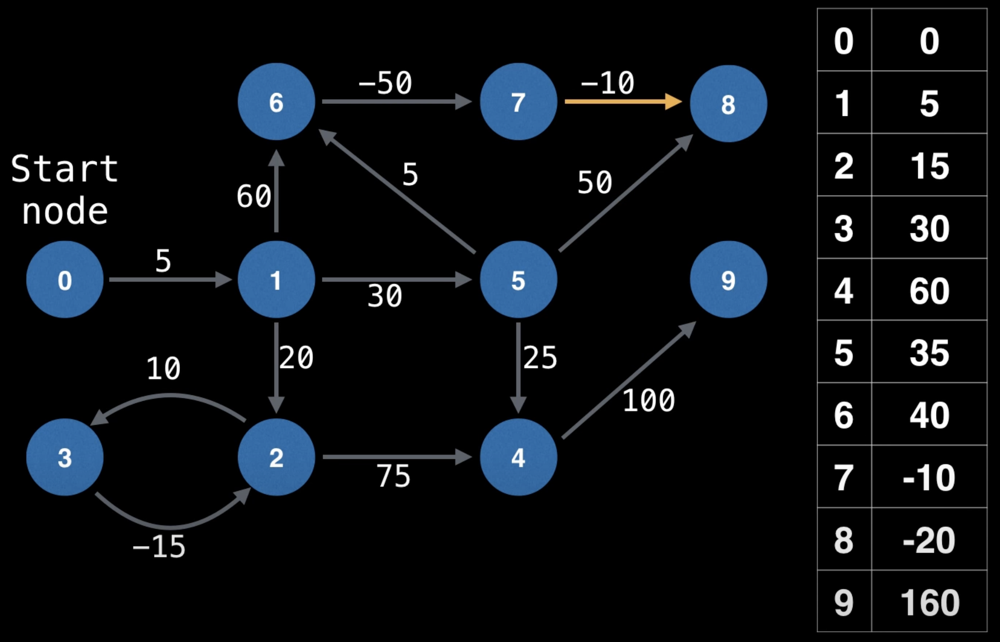

# Cheapest Flights Within K Stops
[LeetCode 787](https://leetcode.com/problems/cheapest-flights-within-k-stops/) [LaiCode 660](https://app.laicode.io/app/problem/660)
## Description
Suppose there are m flights connecting n cities. Flight is represented by an int array int[] where the first element is departure city, the second element is destination city and the third element is the price.

Given a departure city src, a destination city dst, and most # of stops k, return the lowest price of flights can take you from src to dst with at most k stops. If there is no such a route, then return -1.

You can assume that there is no duplicated flights.

Example 1:

Input: n = 3, flights = [[0,1,100],[0,2,1000], [1,2,200]], src = 0, dst = 2, k = 0
Output: 1000

# Solution 0: DP ([Bellman Ford](https://en.wikipedia.org/wiki/Bellman%E2%80%93Ford_algorithm)) (4ms, 97.18%)

The Bellman–Ford algorithm is an algorithm that computes the shortest paths from a single source vertex to all the other vertices in a weighted digraph.[1] It is slower than Dijkstra's algorithm for the same problem, but more versatile, as it is capable of handling graphs in which some of the edge weights are negative numbers. The algorithm was first proposed by Alfonso Shimbel (1955), but is instead named after Richard Bellman and Lester Ford Jr., who published it in 1958 and 1956, respectively.

1. Given V (总节点(数)) and E (总边(数))
2. 给定出发点，可得出到所有点的最短距离
   1. 初始化到所有点的距离为+∞ (or -1, or whatever do not conflict with other vertices)
   2. 遍历所有边, 更新所有可以更新的最小值，顺序不重要
   3. 重复V-1次

[Bellman-Ford in 5 minutes](https://www.youtube.com/watch?v=obWXjtg0L64)

[长视频警告: MIT: Lecture 17: Bellman-Ford](https://www.youtube.com/watch?v=ozsuci5pIso)

[咖喱味，但讲的还不错(包含drawback): 4.4 Bellman Ford Algorithm - Single Source Shortest Path - DP](https://www.youtube.com/watch?v=FtN3BYH2Zes)

不能处理有环而且环总weight是负数的情况.

## Bellman Ford vs dijkstra
O(V*E) vs O((E+V)Log(V)?): O(V^3) vs O(V^2*log(V))

## Bellman Ford DEMO for detecting negative cycle
[Bellman Ford Algorithm | Shortest path & Negative cycles | Graph Theory](https://www.youtube.com/watch?v=lyw4FaxrwHg)





## dp definition
We define dp[i][j] as the min cost to take max i flight segments (i - 1 stops) to get to city j, for k stops, we take k + 1 flight segments;

### Example 2 on LeetCode
Num of  Cities(n): 4

From    City(src): 0

To      City(dst): 3

Max # of Stops(k): 1

All flights:
[0, 1, 100]
[1, 2, 100]
[2, 0, 100]
[1, 3, 600]
[2, 3, 200]

### Initialization and base case (set dp[0][src] = 0)

|     | 0   | 1   | 2   | 3   |
|-----|-----|-----|-----|-----|
| 0   | 0   | -1  | -1  | -1  |
| 1   | -1  | -1  | -1  | -1  |
| 2   | -1  | -1  | -1  | -1  |


### i = 1 segment(s) (0 stop(s))
flights that don't update below table are ignored

i: 1, current flight segment: [0, 1, 100]

|     | 0   | 1   | 2   | 3   |
|-----|-----|-----|-----|-----|
| 0   | 0   | -1  | -1  | -1  |
| 1   | 0   | 100 | -1  | -1  |
| 2   | -1  | -1  | -1  | -1  |

### i = 2 segment(s) (1 stop(s))
flights that don't update below table are ignored

i: 2, current flight segment: [0, 1, 100]

|     | 0   | 1   | 2   | 3   |
|-----|-----|-----|-----|-----|
| 0   | 0   | -1  | -1  | -1  |
| 1   | 0   | 100 | -1  | -1  |
| 2   | 0   | 100 | -1  | -1  |

i: 2, current flight segment: [1, 2, 100]

|     | 0   | 1   | 2   | 3   |
|-----|-----|-----|-----|-----|
| 0   | 0   | -1  | -1  | -1  |
| 1   | 0   | 100 | -1  | -1  |
| 2   | 0   | 100 | 200 | -1  |

i: 2, current flight segment: [1, 3, 600]

|     | 0   | 1   | 2   | 3   |
|-----|-----|-----|-----|-----|
| 0   | 0   | -1  | -1  | -1  |
| 1   | 0   | 100 | -1  | -1  |
| 2   | 0   | 100 | 200 | 700 |

We return dp[2][dst]: 700.

## Time Complexity
O(k*E), E stands for number of edges in the graph, the upper bound of E would be n^2 as there are n nodes in the graph.

It's also O(k * flights.length)

## Space Complexity
O(k*n) for the new dp matrix we created

## DP Code
```java
import java.util.Arrays;

class Solution {
    public int findCheapestPrice(int n, int[][] flights, int src, int dst, int k) {// TC: O(k * EDGE) ==> k*n^2
        int[][] dp = new int[k + 2][n];
        for (int[] a : dp) Arrays.fill(a, -1);
        dp[0][src] = 0;
        for (int i = 1; i <= k + 1; i++) {
            dp[i][src] = 0;
            for (int[] flight : flights)
                if (dp[i - 1][flight[0]] != -1) { // if starting city of current segment was reachable by max i-1 segment(s)
                    int curCost = dp[i - 1][flight[0]] + flight[2];
                    if (dp[i][flight[1]] == -1 || curCost < dp[i][flight[1]]) // if with max i-segments, destination city of current flight segment do not have a cost or new cost is lower, we update current cost
                        dp[i][flight[1]] = curCost;
                }
        }
        return dp[k + 1][dst];
    }
}
```
### A negative example (Example 3 from LeetCode)
Num of  Cities(n): 5

From    City(src): 2

To      City(dst): 1

Max # of Stops(k): 1

All flights:
[4, 1, 1]
[1, 2, 3]
[0, 3, 2]
[0, 4, 10]
[3, 1, 1]
[1, 4, 3]

### Initialization and base case (set dp[0][src] = 0)

|     | 0   | 1   | 2   | 3   | 4   |
|-----|-----|-----|-----|-----|-----|
| 0   | -1  | -1  | 0   | -1  | -1  |
| 1   | -1  | -1  | -1  | -1  | -1  |
| 2   | -1  | -1  | -1  | -1  | -1  |


### i = 1 segment(s) (0 stop(s))
flights that don't update below table are ignored

|     | 0   | 1   | 2   | 3   | 4   |
|-----|-----|-----|-----|-----|-----|
| 0   | -1  | -1  | 0   | -1  | -1  |
| 1   | -1  | -1  | 0   | -1  | -1  |
| 2   | -1  | -1  | -1  | -1  | -1  |

### i = 2 segment(s) (1 stop(s))
flights that don't update below table are ignored

|     | 0   | 1   | 2   | 3   | 4   |
|-----|-----|-----|-----|-----|-----|
| 0   | -1  | -1  | 0   | -1  | -1  |
| 1   | -1  | -1  | 0   | -1  | -1  |
| 2   | -1  | -1  | 0   | -1  | -1  |

What we need to return is dp[k+1][dst] which is dp[2][1] which is -1

## Additional Example

Num of  Cities(n): 6

From    City(src): 0

To      City(dst): 3

Max # of Stops(k): 1

All flights:
[0, 1, 6]
[0, 3, 8]
[0, 4, 27]
[0, 5, 19]
[1, 2, 1]
[1, 3, 2]
[1, 4, 30]
[1, 5, 28]
[2, 3, 7]
[2, 5, 25]
[3, 4, 15]
[3, 5, 23]
[4, 5, 21]

### Initialization and base case (set dp[0][src] = 0)

|     | 0   | 1   | 2   | 3   | 4   | 5   |
|-----|-----|-----|-----|-----|-----|-----|
| 0   | 0   | -1  | -1  | -1  | -1  | -1  |
| 1   | -1  | -1  | -1  | -1  | -1  | -1  |
| 2   | -1  | -1  | -1  | -1  | -1  | -1  |


### i = 1 segment(s) (0 stop(s))
flights that don't update below table are ignored

i: 1, current flight segment: [0, 1, 6]

|     | 0   | 1   | 2   | 3   | 4   | 5   |
|-----|-----|-----|-----|-----|-----|-----|
| 0   | 0   | -1  | -1  | -1  | -1  | -1  |
| 1   | 0   | 6   | -1  | -1  | -1  | -1  |
| 2   | -1  | -1  | -1  | -1  | -1  | -1  |

i: 1, current flight segment: [0, 3, 8]

|     | 0   | 1   | 2   | 3   | 4   | 5   |
|-----|-----|-----|-----|-----|-----|-----|
| 0   | 0   | -1  | -1  | -1  | -1  | -1  |
| 1   | 0   | 6   | -1  | 8   | -1  | -1  |
| 2   | -1  | -1  | -1  | -1  | -1  | -1  |

i: 1, current flight segment: [0, 4, 27]

|     | 0   | 1   | 2   | 3   | 4   | 5   |
|-----|-----|-----|-----|-----|-----|-----|
| 0   | 0   | -1  | -1  | -1  | -1  | -1  |
| 1   | 0   | 6   | -1  | 8   | 27  | -1  |
| 2   | -1  | -1  | -1  | -1  | -1  | -1  |

i: 1, current flight segment: [0, 5, 19]

|     | 0   | 1   | 2   | 3   | 4   | 5   |
|-----|-----|-----|-----|-----|-----|-----|
| 0   | 0   | -1  | -1  | -1  | -1  | -1  |
| 1   | 0   | 6   | -1  | 8   | 27  | 19  |
| 2   | -1  | -1  | -1  | -1  | -1  | -1  |

### i = 2 segment(s) (1 stop(s))
flights that don't update below table are ignored

i: 2, current flight segment: [0, 1, 6]

|     | 0   | 1   | 2   | 3   | 4   | 5   |
|-----|-----|-----|-----|-----|-----|-----|
| 0   | 0   | -1  | -1  | -1  | -1  | -1  |
| 1   | 0   | 6   | -1  | 8   | 27  | 19  |
| 2   | 0   | 6   | -1  | -1  | -1  | -1  |

i: 2, current flight segment: [0, 3, 8]

|     | 0   | 1   | 2   | 3   | 4   | 5   |
|-----|-----|-----|-----|-----|-----|-----|
| 0   | 0   | -1  | -1  | -1  | -1  | -1  |
| 1   | 0   | 6   | -1  | 8   | 27  | 19  |
| 2   | 0   | 6   | -1  | 8   | -1  | -1  |

i: 2, current flight segment: [0, 4, 27]

|     | 0   | 1   | 2   | 3   | 4   | 5   |
|-----|-----|-----|-----|-----|-----|-----|
| 0   | 0   | -1  | -1  | -1  | -1  | -1  |
| 1   | 0   | 6   | -1  | 8   | 27  | 19  |
| 2   | 0   | 6   | -1  | 8   | 27  | -1  |

i: 2, current flight segment: [0, 5, 19]

|     | 0   | 1   | 2   | 3   | 4   | 5   |
|-----|-----|-----|-----|-----|-----|-----|
| 0   | 0   | -1  | -1  | -1  | -1  | -1  |
| 1   | 0   | 6   | -1  | 8   | 27  | 19  |
| 2   | 0   | 6   | -1  | 8   | 27  | 19  |

i: 2, current flight segment: [1, 2, 1]

|     | 0   | 1   | 2   | 3   | 4   | 5   |
|-----|-----|-----|-----|-----|-----|-----|
| 0   | 0   | -1  | -1  | -1  | -1  | -1  |
| 1   | 0   | 6   | -1  | 8   | 27  | 19  |
| 2   | 0   | 6   | 7   | 8   | 27  | 19  |

i: 2, current flight segment: [3, 4, 15]

|     | 0   | 1   | 2   | 3   | 4   | 5   |
|-----|-----|-----|-----|-----|-----|-----|
| 0   | 0   | -1  | -1  | -1  | -1  | -1  |
| 1   | 0   | 6   | -1  | 8   | 27  | 19  |
| 2   | 0   | 6   | 7   | 8   | 23  | 19  |

# Visual representation of graph


# Solution 1: DFS
## idea
We can represent the graph as a map or an array of list(as map key are int array anyway)
The value of array or map will be edges represented by (adjacent) list of Pair value, each pair represent a destination and the cost of flight from current map key (or array index) to this destination.
Array takes more space, and map runs slightly slower.
So it's going to be something like below:

## Time Complexity
O((n-1)!/(n-2-k)!), for each node, we can have max n-1 flights from it,
which create n - 1 node at first level of recursion tree;
at next level, each node can have n - 1 flights taking off (without going back as we de-dup),
so its factorial complexity, but we only go down k+1 level
or its just V+E?

## Space Complexity
O(k+1 + n), height of recursion tree: k + 1, visited array: n
## DFS Code
Below will pass on LaiCode, can't pass on LeetCode (Time Limit Exceeded).
```java
class Solution {
    record City(int id, int cost) {}
    private int res;
    public int findCheapestPrice(int n, int[][] flights, int src, int dst, int k) {
        res = Integer.MAX_VALUE; // must init in method
        // Create the graph
        List<City>[] graph = new List[n];
        for (var flight : flights) {
            int from = flight[0], to = flight[1], cost = flight[2];
            if (graph[from] == null) graph[from] = new ArrayList<>();
            graph[from].add(new City(to, cost));
        }

        // prepare for dfs
        boolean[] visited = new boolean[n];
        dfs(0, src, dst, k + 1, graph, visited);

        return res == Integer.MAX_VALUE ? -1 : res;
    }

    private void dfs(int cost, int src, int dst, int k, List<City>[] graph, boolean[] visited) {
        if (src == dst) {
            res = cost;
            return;
        }

        if (k == 0 || graph[src] == null) return;

        for (City city : graph[src]) {
            int newCost = cost + city.cost;
            if (visited[city.id] || newCost > res) continue;
            visited[city.id] = true;
            dfs(newCost, city.id, dst, k - 1, graph, visited);
            visited[city.id] = false;
        }
    }
}
```
## Solution 1b, DFS with Memo (9ms, 52.74%)
```java
class Solution {
    record City(int id, int cost) {}
    public int findCheapestPrice(int n, int[][] flights, int src, int dst, int k) {
        // Create the graph
        List<City>[] graph = new List[n];
        for (var flight : flights) {
            int from = flight[0], to = flight[1], cost = flight[2];
            if (graph[from] == null) graph[from] = new ArrayList<>();
            graph[from].add(new City(to, cost));
        }

        // prepare for dfs
        Integer[][] visited = new Integer[n][k+2];
        Integer res = dfs(src, dst, k + 1, graph, visited);

        return res == null ? -1 : res;
    }

    private Integer dfs(int src, int dst, int k, List<City>[] graph, Integer[][] visited) {
        if (src == dst) return 0;
        
        if (k == 0 || graph[src] == null) return null;
        
        if (visited[src][k] != null) return visited[src][k];

        Integer res = null;
        for (City city : graph[src]) {
            Integer tmp = dfs(city.id, dst, k - 1, graph, visited);
            if (tmp != null && tmp != -1) {
                int newCost = tmp + city.cost;
                res = res == null ?  newCost: Math.min(res, newCost);
            }
        }
        
        return visited[src][k] = res == null ? -1 : res;
    }
}
```
# Solution 2： Dijkstra's Algorithm (4ms, 97.18%)

## TC/SC:
```java
class Solution {
    record City(int id, int cost) {}
    record Node(int city, int cost, int stops) {}
    public int findCheapestPrice(int n, int[][] flights, int src, int dst, int k) {
        // construct the graph first
        List<City>[] graph = new List[n];
        
        for (var flight : flights) {
            int from = flight[0], to = flight[1], cost = flight[2];
            if (graph[from] == null) graph[from] = new ArrayList<>();
            graph[from].add(new City(to, cost));
        }
        
        PriorityQueue<Node> q = new PriorityQueue<>((a, b) -> (a.cost == b.cost ? a.stops - b.stops : a.cost - b.cost));
        q.offer(new Node(src, 0, 0));
        int[] visited = new int[n];
        Arrays.fill(visited, k + 2);
        
        while (!q.isEmpty()) {
            Node cur = q.poll();
            if (cur.stops >= visited[cur.city]) continue;
            if (cur.city == dst) return cur.cost;
            visited[cur.city] = cur.stops;
            
            if (graph[cur.city] == null) continue;
            for (City city : graph[cur.city])
                q.offer(new Node(city.id, cur.cost + city.cost, cur.stops + 1));
        }
        
        return -1;
    }
}
```
## LeetCode, why?
```java
class Solution {
    record City(int id, int cost) {}
    record Node(int city, int cost, int stops) {}
    public int findCheapestPrice(int n, int[][] flights, int src, int dst, int k) {
        // construct the graph first
        List<City>[] graph = new List[n];
        
        for (var flight : flights) {
            int from = flight[0], to = flight[1], cost = flight[2];
            if (graph[from] == null) graph[from] = new ArrayList<>();
            graph[from].add(new City(to, cost));
        }
        
        PriorityQueue<Node> q = new PriorityQueue<>((a, b) -> (a.cost == b.cost ? a.stops - b.stops : a.cost - b.cost));
        q.offer(new Node(src, 0, 0));
        int[] costs = new int[n];
        int[] stops = new int[n];
        Arrays.fill(costs, Integer.MAX_VALUE);
        Arrays.fill(stops, k + 2);
        costs[src] = stops[src] = 0;
        
        while (!q.isEmpty()) {
            Node cur = q.poll();
            if (cur.city == dst) return cur.cost;
            if (cur.stops== k + 1) continue;
            
            if (graph[cur.city] == null) continue;
            for (City city : graph[cur.city]) {
                Node next = new Node(city.id, cur.cost + city.cost, cur.stops + 1);
                if (next.cost < costs[next.city]) {
                    q.offer(next);
                    costs[next.city] = next.cost;
                    stops[next.city] = next.stops;
                } else if (next.stops < stops[next.city]) {
                    q.offer(next);
                }
            }
        }
        
        return -1;
    }
}
```
# Additional Note
## Code to print dp matrix in Markdown table format
```java
class Solution {
    public int findCheapestPrice(int n, int[][] flights, int src, int dst, int k) {// TC: O(k * EDGE) ==> k*n^2
        System.out.printf("Num of  Cities(n): %d\n\nFrom    City(src): %d\n\nTo      City(dst): %d\n\nMax # of Stops(k): %d\n\nAll flights:\n%s\n\n", n, src, dst, k, Utils.toString(flights));
        int[][] dp = new int[k + 2][n];
        for (int[] a : dp) Arrays.fill(a, -1);
        dp[0][src] = 0;
        System.out.println("### Initialization and base case (set dp[0][src] = 0)\n");
        System.out.println(toStringMD(dp, 4));

        String cur, pre = "";

        for (int i = 1; i <= k + 1; i++) {
            dp[i][src] = 0;
            System.out.printf("\n### i = %d segment(s) (%d stop(s))\nflights that don't update below table are ignored\n", i, i - 1);
            for (int[] flight : flights) {
                if (dp[i - 1][flight[0]] != -1) {

                    int newCost = dp[i - 1][flight[0]] + flight[2];
                    if (dp[i][flight[1]] == -1 || newCost < dp[i][flight[1]])
                        dp[i][flight[1]] = newCost;
                }
                cur = toStringMD(dp, 4);
                if (!cur.equals(pre))
                    System.out.printf("\ni: %d, current flight segment: %s\n\n%s", i, Arrays.toString(flight), cur);
                pre = cur;
                //System.out.printf("i: %d, flight: %s\n\n%s", i, Arrays.toString(flight), cur);
            }
        }

        return dp[k + 1][dst];
    }
}
```
## Test cases in code format
```java
class Solution {
    public static void main(String[] args) {
        Solution sol = new Solution();
        System.out.println(sol.findCheapestPrice(6, new int[][]{{0, 1, 6}, {0, 3, 8}, {0, 4, 27}, {0, 5, 19}, {1, 2, 1}, {1, 3, 2}, {1, 4, 30}, {1, 5, 28}, {2, 3, 7}, {2, 5, 25}, {3, 4, 15}, {3, 5, 23}, {4, 5, 21}}, 0, 3, 25));// 8
        System.out.println(sol.findCheapestPrice(6, new int[][]{{0, 1, 6}, {0, 3, 8}, {0, 4, 27}, {0, 5, 19}, {1, 2, 1}, {1, 3, 2}, {1, 4, 30}, {1, 5, 28}, {2, 3, 7}, {2, 5, 25}, {3, 4, 15}, {3, 5, 23}, {4, 5, 21}}, 0, 3, 1));// 8
        System.out.println(sol.findCheapestPrice(4, new int[][]{{0, 1, 1}, {0, 2, 5}, {1, 2, 1}, {2, 3, 1}}, 0, 3, 1)); // 6
        System.out.println(sol.findCheapestPrice(3, new int[][]{{0, 1, 400}, {1, 2, 250}, {0, 2, 750}}, 0, 2, 1)); // 650
        System.out.println(sol.findCheapestPrice(5, new int[][]{{4,1,1},{1,2,3},{0,3,2},{0,4,10},{3,1,1},{1,4,3}}, 2, 1, 1)); // -1
        System.out.println(sol.findCheapestPrice(4, new int[][]{{0,1,100},{1,2,100},{2,0,100},{1,3,600},{2,3,200}}, 0, 3, 1)); // -1
    }
}
```