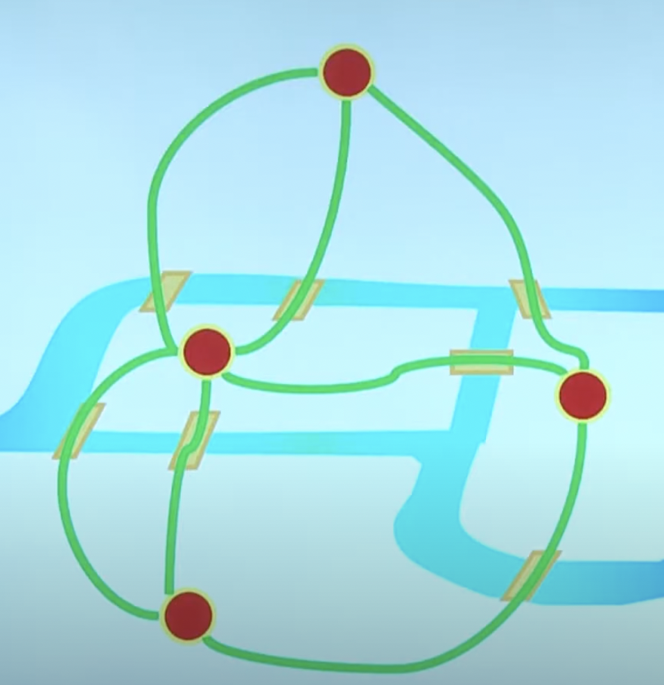

# LC 332. Reconstruct Itinerary
[332. Reconstruct Itinerary](https://leetcode.com/problems/reconstruct-itinerary/)

[LaiCode 466. Reconstruct Itinerary](https://app.laicode.io/app/problem/466)

[花花酱 LeetCode 332. Reconstruct Itinerary - 刷题找工作 EP52](https://www.youtube.com/watch?v=4udFSOWQpdg)

[332 - Reconstruct Itinerary【FLAG高频精选面试题讲解】](https://www.youtube.com/watch?v=LKSdX31pXjY)

## Solution 1 DFS

TC: LaiOffer: O(n + nlogn + (n-1)!), LeetCode: E^d, where |E|∣E∣ is the number of total flights and dd is the maximum number of flights from an airport.

SC: LaiOffer: O(n), LeetCode: O(V+E)

```java
class Solution {
    public List<String> findItinerary(List<List<String>> tickets) {
        Map<String, List<String>> graph = createGraph(tickets);
        Map<String, boolean[]> visited = createVisited(graph);
        List<String> sol = new ArrayList<>(tickets.size() + 1);
        dfs("JFK", sol, graph, visited, tickets.size());
        return sol;
    }

    public boolean dfs(String cur, List<String> sol, Map<String, List<String>> graph, Map<String, boolean[]> visited, int n) {

        sol.add(cur);
        if (sol.size() == n + 1) return true;

        List<String> neighbors = graph.get(cur);

        if (neighbors == null) {
            sol.remove(sol.size() - 1);
            return false;
        }

        boolean[] v = visited.get(cur);
        for (int i = 0; i < neighbors.size(); i++) {
            String nei = neighbors.get(i);
            if (v[i]) continue;
            v[i] = true;
            if (dfs(nei, sol, graph, visited, n)) return true;
            v[i] = false;
        }

        sol.remove(sol.size() - 1);
        return false;
    }

    private Map<String, boolean[]> createVisited(Map<String, List<String>> graph) {
        Map<String, boolean[]> visited = new HashMap<>();

        for (Map.Entry<String, List<String>> set : graph.entrySet()) {
            Collections.sort(set.getValue());
            visited.put(set.getKey(), new boolean[set.getValue().size()]);
        }


        return visited;
    }

    public Map<String, List<String>> createGraph(List<List<String>> tickets) {
        Map<String, List<String>> graph = new HashMap<>();
        for (var edge : tickets) {
            String start = edge.get(0), end = edge.get(1);
            List<String> edges = graph.get(start);
            if (edges == null) {
                edges = new ArrayList<>();
                graph.put(start, edges);
            }

            edges.add(end);
        }
        return graph;
    }
}
```

## 
### 欧拉路径 (1736)
[一笔画问题](https://zh.wikipedia.org/wiki/%E4%B8%80%E7%AC%94%E7%94%BB%E9%97%AE%E9%A2%98)
[Eulerian path](https://en.wikipedia.org/wiki/Eulerian_path)

[柯尼斯堡七桥问题](https://zh.wikipedia.org/wiki/%E6%9F%AF%E5%B0%BC%E6%96%AF%E5%A0%A1%E4%B8%83%E6%A1%A5%E9%97%AE%E9%A2%98)


[欧拉道路与欧拉回路](https://www.youtube.com/watch?v=vjpzmnVuHjw)
欧拉回路: 无向图: 连通图且所有定点都是偶数度, 有向图: 出度入度相等

欧拉路径: 连通图且奇数度的点不超过两个，
无向图: 有且只有1个出度比入度多一个(欧拉路径起点) && 有且只有1个入读比出度多一个(终点🏁) && 其他所有点出度=入度 || 所有点出度=入度

已知图上存在欧拉路径，找到一个欧拉路径:
[Hierholzer’s Algorithm](https://slaystudy.com/hierholzers-algorithm/) () O(E)

[Fleury’s algorithm](https://slaystudy.com/fleurys-algorithm/) O(E^2)
