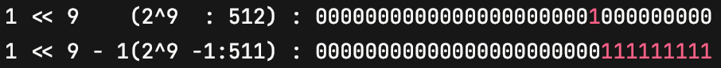
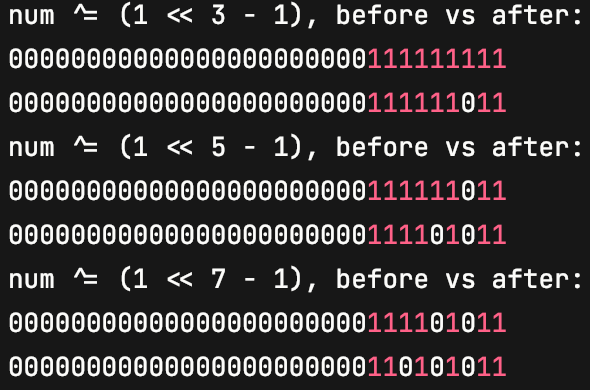
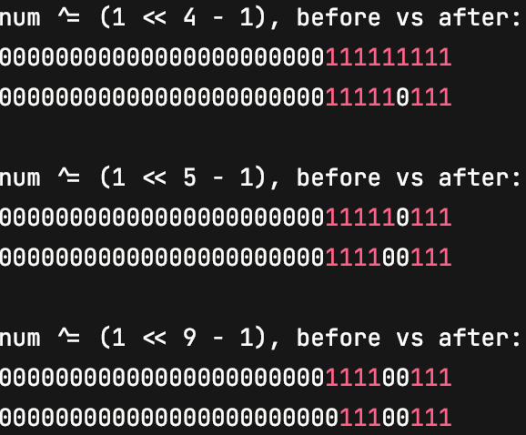
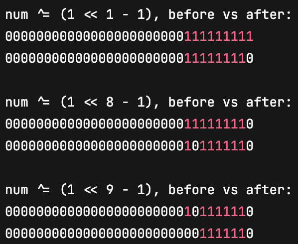
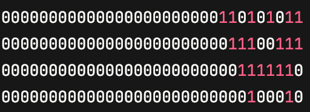
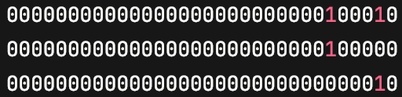
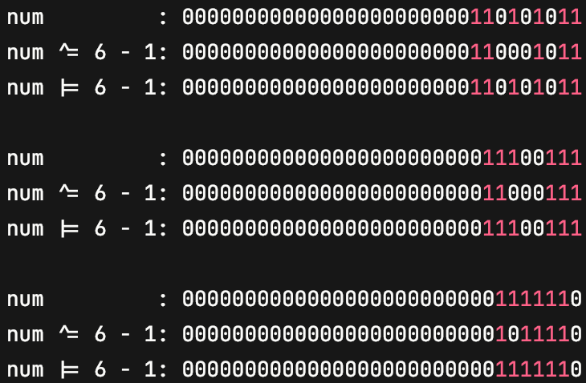

# [37. Sudoku Solver](https://leetcode.com/problems/sudoku-solver/)
## Hardest Sudoku Board on earth (Says who?)
<pre>
To put this test case on LeetCode:
[["2", ".", ".", ".", ".", ".", "8", ".", "."],[".", ".", ".", "5", ".", ".", "1", ".", "."],["7", ".", "4", ".", ".", ".", ".", ".", "."],[".", ".", ".", ".", ".", "2", ".", "7", "."],["6", ".", ".", ".", "4", ".", ".", ".", "."],[".", "1", ".", ".", ".", ".", ".", ".", "."],["3", ".", ".", ".", ".", ".", ".", "2", "."],[".", ".", ".", "1", ".", "5", ".", ".", "."],[".", ".", ".", "6", "8", ".", ".", ".", "."]]

for better readability:
2  .  .  |  .  .  .  |  8  .  .  
.  .  .  |  5  .  .  |  1  .  .  
7  .  4  |  .  .  .  |  .  .  .  
-------------------------------
.  .  .  |  .  .  2  |  .  7  .  
6  .  .  |  .  4  .  |  .  .  .  
.  1  .  |  .  .  .  |  .  .  .  
-------------------------------
3  .  .  |  .  .  .  |  .  2  .  
.  .  .  |  1  .  5  |  .  .  .  
.  .  .  |  6  8  .  |  .  .  . 
</pre>
## Solution 1: Basic DFS, with boolean matrix to de-dup (725ms)
### Statistics
<pre>
LeetCode    : 2ms

The hardest Case:
Search Depth: 11,864,158
Runtime     : 725ms
</pre>

### Space & Time
TC: O(9^m)

SC: O(81*3)
```java
class Solution {
    int depth, n = 9;
    boolean[][] rows, cols, sqrs;
    public void solveSudoku(char[][] board) {
        rows = new boolean[n][n];
        cols = new boolean[n][n];
        sqrs = new boolean[n][n];
        depth = 0;

        for (int r = 0; r < n; r++) for (int c = 0; c < n; c++)
            if (board[r][c] != '.') {
                int val = board[r][c] - '1';
                rows[r][val] = cols[c][val] = sqrs[r/3*3+c/3][val] = true;
            }

        solve(board, 0);
        System.out.printf("Search Depth: %,d \n", depth);
    }

    private boolean solve(char[][] board, int d) {
        if (d == 81) return true;
        depth++;
        int r = d / n, c = d % n, s = r/3*3 + c/3;
        if (board[r][c] != '.') return solve(board, d + 1);

        for (int i = 0; i < n; i++)
            if (!rows[r][i] && !cols[c][i] && !sqrs[s][i]) {
                board[r][c] = (char)('1' + i);
                rows[r][i] = cols[c][i] = sqrs[s][i] = true;
                if (solve(board, d + 1)) return true;
                rows[r][i] = cols[c][i] = sqrs[s][i] = false;
            }
        board[r][c] = '.';
        return false;
    }
}
```

## Solution 1b, bit-operation, and chose available numbers directly (110ms)
### Statistics
<pre>
LeetCode    : 1ms

The hardest Case:
Search Depth: 4,328,559
Runtime     : 110ms
</pre>
### Time and Space
TC: O(9^m)

SC: O(m+27)
```java
class Solution {
    record Cell (int r, int c, int s) {}
    Cell[] cells; // all empty cells to fill
    int depth, size;
    private final int n = 9, ALL_ON = (1 << 9) - 1; // 0~8: 9 1s, each 1 denotes that bit is available to use
    int[] rows, cols, sqrs;
    public void solveSudoku(char[][] board) {
        depth = 0;
        rows = new int[n]; cols = new int[n]; sqrs = new int[n];
        Arrays.fill(rows, ALL_ON);
        Arrays.fill(cols, ALL_ON);
        Arrays.fill(sqrs, ALL_ON);
        cells = new Cell[81];

        for (int r = 0; r < n; r++) for (int c = 0; c < n; c++) {
            int s = r / 3 * 3 + c / 3;
            if (board[r][c] == '.') cells[size++] = new Cell(r, c, s);
            else {
                int mask = 1 << (board[r][c] - '1'); // '8' ==> 2^7 ==> 128
                rows[r] ^= mask;
                cols[c] ^= mask;
                sqrs[s] ^= mask;
            }
        }

        solve(board, 0);
        // System.out.printf("Search Depth: %,d \n", depth);
    }

    private boolean solve(char[][] board, int d) {
        if (d == size) return true;
        // depth++;
        Cell c = cells[d];

        int nums = rows[c.r] & cols[c.c] & sqrs[c.s];
        while (nums != 0) {
            int num = 31 - Integer.numberOfLeadingZeros(nums);
            board[c.r][c.c] = (char)(num + '1');

            int mask = 1 << num;

            rows[c.r] ^= mask;
            cols[c.c] ^= mask;
            sqrs[c.s] ^= mask;

            if (solve(board, d + 1)) return true;

            rows[c.r] |= mask;
            cols[c.c] |= mask;
            sqrs[c.s] |= mask;

            nums ^= mask;
        }
        return false;
    }
}
```
## Solution 2, always chose the cell with the least available options
<pre>
LeetCode    : 0ms

The hardest Case:
Search Depth: 1,882
Runtime     : 1ms
</pre>

#### Detail regarding bit-operation
##### 1 << 9 -1

##### ^= (3,5,7) (say rows?)

##### ^= (4,5,9) (say cols?)

##### ^= (1,8,9) (say sqrs?)

##### rows & cols & sqrs (2, 6 left available)


(Integer.numberOfLeadingZeros(avails): 26), 31 - 26 = 5;
##### nums ^= 1 << (6 - 1);

##### rows, cols, sqrs ^= (6-1) and |= (6-1)

```java
class Solution {
    record Cell (int r, int c, int s) {}
    Cell[] cells; // all empty cells to fill
    int depth, size;
    private final int n = 9, ALL_ON = (1 << 9) - 1; // 0~8: 9 1s, each 1 denotes that bit is available to use
    int[] rows, cols, sqrs;
    public void solveSudoku(char[][] board) {
        depth = 0; size = 0;
        rows = new int[n]; cols = new int[n]; sqrs = new int[n];
        Arrays.fill(rows, ALL_ON);
        Arrays.fill(cols, ALL_ON);
        Arrays.fill(sqrs, ALL_ON);
        cells = new Cell[81];

        for (int r = 0; r < n; r++) for (int c = 0; c < n; c++) {
            int s = r / 3 * 3 + c / 3;
            if (board[r][c] == '.') cells[size++] = new Cell(r, c, s);
            else {
                int mask = 1 << (board[r][c] - '1'); // '8' ==> 2^7 ==> 128
                rows[r] ^= mask;
                cols[c] ^= mask;
                sqrs[s] ^= mask;
            }
        }

        solve(board, 0);
         System.out.printf("Search Depth: %,d \n", depth);
    }

    private boolean solve(char[][] board, int d) {
        if (d == size) return true;
         depth++;
        int best = getBest(d);
        if (best == -1) return false; // if there's one cell not working, backtrack
        swapCell(d, best);
        Cell c = cells[d];

        int nums = rows[c.r] & cols[c.c] & sqrs[c.s];
        while (nums != 0) {
            int num = 31 - Integer.numberOfLeadingZeros(nums); // position of highest 1
            board[c.r][c.c] = (char)(num + '1');

            int mask = 1 << num;

            rows[c.r] ^= mask;
            cols[c.c] ^= mask;
            sqrs[c.s] ^= mask;

            if (solve(board, d + 1)) return true;

            rows[c.r] |= mask;
            cols[c.c] |= mask;
            sqrs[c.s] |= mask;

            nums ^= mask;
        }
        return false;
    }

    private int getBest(int cur) { // get cell with the least available options from [cur, size)
        int best = -1, min = 10;
        for (int i = cur; i < size; i++) {
            Cell c = cells[i];
            int mask = rows[c.r] & cols[c.c] & sqrs[c.s];
            if (mask == 0) return -1; // if a cell has no available numbers, this path is doomed
            int choices = Integer.bitCount(mask);
//            if (choices == 1) return i; // intentionally left this out, we want mask == 0 to exit for sure
            if (choices < min) {
                best = i;
                min = choices;
            }
        }
        return best;
    }

    private void swapCell(int i, int j) {
        Cell c = cells[i];
        cells[i] = cells[j];
        cells[j] = c;
    }
}
```
## 李显龙 c Solution Java 版本, 仅供参考
[李显龙Original 0ms c Code](https://drive.google.com/drive/u/0/folders/0B2G2LjIu7WbdfjhaUmVzc1lCR2hUdk5fZllCOHdtbFItbU5qYzdqZGVxdmlnRkJyYVQ4VU0?resourcekey=0-D2Vpv_-JlV4qo2aSDdGFLA)

[知乎](https://www.zhihu.com/question/30110719)
<pre>
LeetCode    : 0 or 1ms?

The hardest Case:
Search Depth: 12,368
Runtime     : 4ms
</pre>
[1ms submission](https://leetcode.com/submissions/detail/755978670/)
```java
class Solution {
    static final int ALL_ZEROS = 0;
    static final int ALL_ONES = 0x3fe;
    int[] row_bitmap, col_bitmap, cube_bitmap, entry, sequence;
    // Always points to the first empty cell's SQUARE index, which is stored in SEQUENCE
    int seq_start;
    // Utility arrays to store mapping from SQUARE to ROW/COLs/CUBES: e.g. 37 -> cube[1, 0], whose 1D index is 3;
    int[] square_to_row, square_to_col, square_to_cube;

    public void solveSudoku(char[][] board) {
        seq_start = 0;
        row_bitmap = new int[9];
        col_bitmap = new int[9];
        cube_bitmap = new int[9];
        entry = new int[81];
        sequence = new int[81];
        square_to_row = new int[81];
        square_to_col = new int[81];
        square_to_cube = new int[81];
        // Initialize all helping data structures
        // All digits are initially all available (marked by 1) in all rows/columns/cubes
        for (int i = 0; i < 9; i++)
            row_bitmap[i] = col_bitmap[i] = cube_bitmap[i] = ALL_ONES;
        // Sequence stores all SQUARE indices of all cells, with 0..start-1 being all filled cells, and the rest all empty
        // All cells initially all empty
        for (int i = 0; i < 81; i++)
            sequence[i] = i;
        for (int i = 0; i < 9; i++)
            for (int j = 0; j < 9; j++) {
                // Mapping from SQUARE to I/J is also beneficial: avoid calculating I/J from SQUARE later
                int square = i * 9 + j;
                square_to_row[square] = i;
                square_to_col[square] = j;
                square_to_cube[square] = (i / 3) * 3 + j / 3;
            }
        // Fill in the given cells. Update the bitmaps at the same time
        for (int i = 0; i < 9; i++)
            for (int j = 0; j < 9; j++)
                if (board[i][j] != '.') {
                    int square = i * 9 + j, val = board[i][j] - '0', valbit = 1 << val;
                    row_bitmap[i] &= ~valbit;
                    col_bitmap[j] &= ~valbit;
                    cube_bitmap[(i / 3) * 3 + j / 3] &= ~valbit;
                    entry[square] = valbit;
                    int seq_iter = seq_start;
                    // Compact non-empty cells to the front, and use SEQ_START to mark the first empty cell's position
                    while (seq_iter < 81 && sequence[seq_iter] != square)
                        seq_iter++;
                    swapSeq(seq_start++, seq_iter);
                }
        // main solver process
        boolean success = place(seq_start);
        assert success : "Unsolvable Puzzle!";
        // dump result back from ENTRY array to BOARD
        for (int s = 0; s < 81; s++) {
            int i = square_to_row[s], j = square_to_col[s];
            board[i][j] = (char) (Integer.numberOfTrailingZeros(entry[s]) + '0');
        }
    }

    boolean place(int seq_pos) {
        if (seq_pos >= 81)
            return true;
        int seq_next = nextPos(seq_pos);
        swapSeq(seq_pos, seq_next);
        int square = sequence[seq_pos], row_idx = square_to_row[square], col_idx = square_to_col[square], cube_idx = square_to_cube[square];
        int cell_bitmap = row_bitmap[row_idx] & col_bitmap[col_idx] & cube_bitmap[cube_idx];
        while (cell_bitmap > 0) {
            // Get each available bit/digit in order
            int next_digit_bit = cell_bitmap & -cell_bitmap;
            cell_bitmap &= ~next_digit_bit;
            entry[square] = next_digit_bit;
            // claim this DIGIT is used in row/column/cube
            row_bitmap[row_idx] &= ~next_digit_bit;
            col_bitmap[col_idx] &= ~next_digit_bit;
            cube_bitmap[cube_idx] &= ~next_digit_bit;

            if (place(seq_pos + 1))
                return true;

            // undo claims in the bitmaps
            row_bitmap[row_idx] |= next_digit_bit;
            col_bitmap[col_idx] |= next_digit_bit;
            cube_bitmap[cube_idx] |= next_digit_bit;
            entry[square] = ALL_ZEROS;
        }
        swapSeq(seq_pos, seq_next);
        return false;
    }

    // Find among empty cells the one with the smallest search space: least bits on its bitmap;
    int nextPos(int pos) {
        int min_idx = pos, min_digit_count = 100;
        for (int i = pos; i < 81; i++) {
            int square = sequence[i];
            // Number of bits in CELL_BITMAP is the number of digits that this cell can take
            int cell_bitmap = row_bitmap[square_to_row[square]] & col_bitmap[square_to_col[square]] & cube_bitmap[square_to_cube[square]];
            // Counts the bits, so you know how many digits this CELL can take: we want the minimum one
            int num_possible_digits = Integer.bitCount(cell_bitmap);
            if (num_possible_digits < min_digit_count) {
                min_idx = i;
                min_digit_count = num_possible_digits;
            }
        }
        return min_idx;
    }

    void swapSeq(int i, int j) {
        int tmp = sequence[i];
        sequence[i] = sequence[j];
        sequence[j] = tmp;
    }
}
```