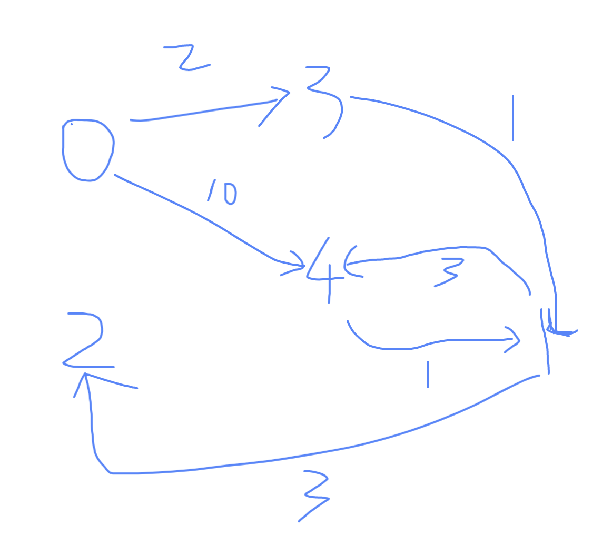
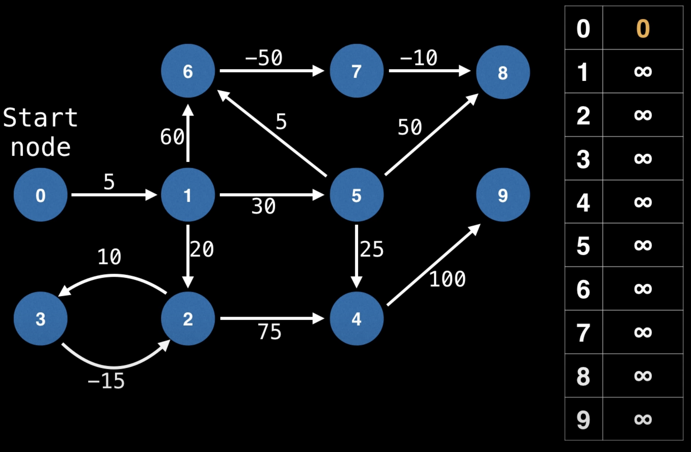

# [787. Cheapest Flights Within K Stops](https://leetcode.com/problems/cheapest-flights-within-k-stops/)
1. [Bellman Ford, DP Context](#Bellman_Ford_DP_Context)
2. [Bellman Ford, DP(4ms, 96.87%) code](#DP_Code)
3. [BFS with cost de-dup(4ms, 96.87%)](#BFS_cost_dedup)
4. [Dijkstra(4ms, 96.87%)](#Dijkstra)
5. [DFS with Memo (7ms, 80.94%)](#DFS_with_Memo)
6. [Bellman Ford negative cycle detection](#Bellman_Ford_detecting_negative_cycle)
# [Bellman_Ford_DP_Context](https://en.wikipedia.org/wiki/Bellman%E2%80%93Ford_algorithm) (4ms, 97.18%)
The Bellman–Ford algorithm
1. Computes the shortest paths from a single source vertex to all the other vertices in a weighted digraph.[1]
2. Slower than Dijkstra's algorithm for the same problem
3. Capable of handling negative edges (but not circle with total weight negative)
4. First proposed by Alfonso Shimbel (1955), but is instead named after Richard Bellman and Lester Ford Jr., who published it in 1958 and 1956, respectively.

一些视频参考
1. [Bellman-Ford in 5 minutes](https://www.youtube.com/watch?v=obWXjtg0L64)
2. [讲的还不错的咖喱味Bellman Ford, with negative circle drawback](https://www.youtube.com/watch?v=FtN3BYH2Zes)
3. [Bellman Ford Algorithm | Shortest path & Negative cycles | Graph Theory](https://www.youtube.com/watch?v=lyw4FaxrwHg&list=PLDV1Zeh2NRsDGO4--qE8yH72HFL1Km93P&index=20)
4. 长视频警告
   1. [MIT 6.006, Fall 2011, Lecture 17, Bellman-Ford](https://www.youtube.com/watch?v=ozsuci5pIso)
   2. [MIT 6.006, Spring 2020, Lecture 12, Bellman-Ford](https://www.youtube.com/watch?v=f9cVS_URPc0&list=PLUl4u3cNGP63EdVPNLG3ToM6LaEUuStEY&index=18)


1. Given V (总节点(数)) and E (总边(数))
2. 给定出发点，可得出到所有点的最短距离
   1. 初始化到所有点的距离为+∞ (or -1, or whatever do not conflict with other vertices)
   2. 遍历所有边, 更新所有可以更新的最小值，顺序不重要
   3. 重复V-1次

不能处理有环而且环总weight是负数的情况.

## Bellman Ford vs dijkstra
O(V*E) vs O((E+V)Log(V)?): O(V^3) vs O(V^2*log(V))

## dp definition
We define dp[i][j] as the min cost to take max i flight segments (i - 1 stops) to get to city j, for k stops, we take k + 1 flight segments;

### Example 2 on LeetCode
<pre>
Num of  Cities(n): 4
From    City(src): 0
To      City(dst): 3
Max # of Stops(k): 1

All flights:
[0, 1, 100]
[1, 2, 100]
[2, 0, 100]
[1, 3, 600]
[2, 3, 200]
</pre>


### Initialization and base case (set dp[0][src] = 0)

|     | 0   | 1   | 2   | 3   |
|-----|-----|-----|-----|-----|
| 0   | 0   | -1  | -1  | -1  |
| 1   | 0   | -1  | -1  | -1  |
| 2   | 0   | -1  | -1  | -1  |


### i = 1 segment(s) (0 stop(s))
flights that don't update below table are ignored

i: 1, current flight segment: [0, 1, 100]

|     | 0   | 1   | 2   | 3   |
|-----|-----|-----|-----|-----|
| 0   | 0   | -1  | -1  | -1  |
| 1   | 0   | 100 | -1  | -1  |
| 2   | 0   | -1  | -1  | -1  |

### i = 2 segment(s) (1 stop(s))
flights that don't update below table are ignored

i: 2, current flight segment: [0, 1, 100]

|     | 0   | 1   | 2   | 3   |
|-----|-----|-----|-----|-----|
| 0   | 0   | -1  | -1  | -1  |
| 1   | 0   | 100 | -1  | -1  |
| 2   | 0   | 100 | -1  | -1  |

i: 2, current flight segment: [1, 2, 100]

|     | 0   | 1   | 2   | 3   |
|-----|-----|-----|-----|-----|
| 0   | 0   | -1  | -1  | -1  |
| 1   | 0   | 100 | -1  | -1  |
| 2   | 0   | 100 | 200 | -1  |

i: 2, current flight segment: [1, 3, 600]

|     | 0   | 1   | 2   | 3   |
|-----|-----|-----|-----|-----|
| 0   | 0   | -1  | -1  | -1  |
| 1   | 0   | 100 | -1  | -1  |
| 2   | 0   | 100 | 200 | 700 |

We return dp[2][dst]: 700.

## Time Complexity
O(k*E), E stands for number of edges in the graph, the upper bound of E would be n^2 as there are n nodes in the graph.

It's also O(k * flights.length)

## Space Complexity
O(k*n) for the new dp matrix we created

## DP_Code
TC: O(k * E), SC: O(n * k)
```java
class Solution {
   public int findCheapestPrice(int n, int[][] flights, int src, int dst, int k) {
      int[][] dp = new int[k+2][n]; // 
      for (var a : dp) Arrays.fill(a, -1);
      for (int i = 0; i < k + 2; i++) dp[i][src] = 0;

      for (int i = 1; i < k + 2; i++) { // k + 1 loops
         for (var f : flights) {
            int departure = f[0], arrival = f[1], cost = f[2];
            if (dp[i-1][departure] == -1) continue;
            int newCost = dp[i-1][departure] + cost;
            if (dp[i][arrival] == -1 || newCost < dp[i][arrival]) {
               dp[i][arrival] = newCost;
            }
         }
      }

      return dp[k+1][dst];
   }
}
```
### Space Optimized, 5 ms, 91.8%
TC: O(k * E), SC: O(n)
```java
class Solution {
   // SC: O(n), TC: (k+1)*E
   public int findCheapestPrice(int n, int[][] flights, int src, int dst, int k) {
      int[][] dp = new int[2][n]; // 
      for (var a : dp) Arrays.fill(a, -1);
      dp[0][src] = dp[1][src] = 0;

      for (int i = 1; i < k + 2; i++) { // k + 1 loops
         int i0 = i%2, i1 = (i-1)%2;
         for (var f : flights) {
            int departure = f[0], arrival = f[1], cost = f[2];
            if (dp[i1][departure] == -1) continue;
            int newCost = dp[i1][departure] + cost;
            if (dp[i0][arrival] == -1 || newCost < dp[i0][arrival]) {
               dp[i0][arrival] = newCost;
            }
         }
      }

      return dp[(k+1)%2][dst];
   }
}
```
### A negative example (Example 3 from LeetCode)
<pre>
Num of  Cities(n): 5
From    City(src): 2
To      City(dst): 1
Max # of Stops(k): 1

All flights:
[4, 1, 1]
[1, 2, 3]
[0, 3, 2]
[0, 4, 10]
[3, 1, 1]
[1, 4, 3]
</pre>


|     | 0   | 1   | 2   | 3   | 4   |
|-----|-----|-----|-----|-----|-----|
| 0   | -1  | -1  | 0   | -1  | -1  |
| 1   | -1  | -1  | 0   | -1  | -1  |
| 2   | -1  | -1  | 0   | -1  | -1  |

What we need to return is dp[k+1][dst] which is dp[2][1] which is -1

## Additional Example

<pre>
Num of  Cities(n): 6
From    City(src): 0
To      City(dst): 3
Max # of Stops(k): 1

All flights:
[0, 1, 6]
[0, 3, 8]
[0, 4, 27]
[0, 5, 19]
[1, 2, 1]
[1, 3, 2]
[1, 4, 30]
[1, 5, 28]
[2, 3, 7]
[2, 5, 25]
[3, 4, 15]
[3, 5, 23]
[4, 5, 21]</pre>


### Initialization and base case (set dp[0][src] = 0)

|     | 0   | 1   | 2   | 3   | 4   | 5   |
|-----|-----|-----|-----|-----|-----|-----|
| 0   | 0   | -1  | -1  | -1  | -1  | -1  |
| 1   | 0   | -1  | -1  | -1  | -1  | -1  |
| 2   | 0   | -1  | -1  | -1  | -1  | -1  |

### i = 1 segment(s) (0 stop(s))
flights that don't update below table are ignored

i: 1, current flight segment: [0, 1, 6]

|     | 0   | 1   | 2   | 3   | 4   | 5   |
|-----|-----|-----|-----|-----|-----|-----|
| 0   | 0   | -1  | -1  | -1  | -1  | -1  |
| 1   | 0   | 6   | -1  | -1  | -1  | -1  |
| 2   | 0   | -1  | -1  | -1  | -1  | -1  |

i: 1, current flight segment: [0, 3, 8]

|     | 0   | 1   | 2   | 3   | 4   | 5   |
|-----|-----|-----|-----|-----|-----|-----|
| 0   | 0   | -1  | -1  | -1  | -1  | -1  |
| 1   | 0   | 6   | -1  | 8   | -1  | -1  |
| 2   | 0   | -1  | -1  | -1  | -1  | -1  |

i: 1, current flight segment: [0, 4, 27]

|     | 0   | 1   | 2   | 3   | 4   | 5   |
|-----|-----|-----|-----|-----|-----|-----|
| 0   | 0   | -1  | -1  | -1  | -1  | -1  |
| 1   | 0   | 6   | -1  | 8   | 27  | -1  |
| 2   | 0   | -1  | -1  | -1  | -1  | -1  |

i: 1, current flight segment: [0, 5, 19]

|     | 0   | 1   | 2   | 3   | 4   | 5   |
|-----|-----|-----|-----|-----|-----|-----|
| 0   | 0   | -1  | -1  | -1  | -1  | -1  |
| 1   | 0   | 6   | -1  | 8   | 27  | 19  |
| 2   | 0   | -1  | -1  | -1  | -1  | -1  |

### i = 2 segment(s) (1 stop(s))
flights that don't update below table are ignored

i: 2, current flight segment: [0, 1, 6]

|     | 0   | 1   | 2   | 3   | 4   | 5   |
|-----|-----|-----|-----|-----|-----|-----|
| 0   | 0   | -1  | -1  | -1  | -1  | -1  |
| 1   | 0   | 6   | -1  | 8   | 27  | 19  |
| 2   | 0   | 6   | -1  | -1  | -1  | -1  |

i: 2, current flight segment: [0, 3, 8]

|     | 0   | 1   | 2   | 3   | 4   | 5   |
|-----|-----|-----|-----|-----|-----|-----|
| 0   | 0   | -1  | -1  | -1  | -1  | -1  |
| 1   | 0   | 6   | -1  | 8   | 27  | 19  |
| 2   | 0   | 6   | -1  | 8   | -1  | -1  |

i: 2, current flight segment: [0, 4, 27]

|     | 0   | 1   | 2   | 3   | 4   | 5   |
|-----|-----|-----|-----|-----|-----|-----|
| 0   | 0   | -1  | -1  | -1  | -1  | -1  |
| 1   | 0   | 6   | -1  | 8   | 27  | 19  |
| 2   | 0   | 6   | -1  | 8   | 27  | -1  |

i: 2, current flight segment: [0, 5, 19]

|     | 0   | 1   | 2   | 3   | 4   | 5   |
|-----|-----|-----|-----|-----|-----|-----|
| 0   | 0   | -1  | -1  | -1  | -1  | -1  |
| 1   | 0   | 6   | -1  | 8   | 27  | 19  |
| 2   | 0   | 6   | -1  | 8   | 27  | 19  |

i: 2, current flight segment: [1, 2, 1]

|     | 0   | 1   | 2   | 3   | 4   | 5   |
|-----|-----|-----|-----|-----|-----|-----|
| 0   | 0   | -1  | -1  | -1  | -1  | -1  |
| 1   | 0   | 6   | -1  | 8   | 27  | 19  |
| 2   | 0   | 6   | 7   | 8   | 27  | 19  |

i: 2, current flight segment: [3, 4, 15]

|     | 0   | 1   | 2   | 3   | 4   | 5   |
|-----|-----|-----|-----|-----|-----|-----|
| 0   | 0   | -1  | -1  | -1  | -1  | -1  |
| 1   | 0   | 6   | -1  | 8   | 27  | 19  |
| 2   | 0   | 6   | 7   | 8   | 23  | 19  |

### Missing Test Case

# BFS_cost_dedup
<pre>
TC: Upper Bound O(V+E)?
SC: Graph + Queue + costs: O(V+E) + C * V + V ~ O(V+E), E could be up to V^2
</pre>
```java
class Solution {
   record Edge (int id, int cost) {}
   record Node (int id, int cost, int steps) {}
   public int findCheapestPrice(int n, int[][] flights, int src, int dst, int k) {
      // create Graph
      List<Edge>[] graph = new List[n];
      for (int i = 0; i < n; i++) graph[i] = new ArrayList<>();
      for (var f : flights) graph[f[0]].add(new Edge(f[1], f[2]));

      // for de-dup
      int[] costs = new int[n];
      Arrays.fill(costs, -1);
      costs[src] = 0;

      // BFS
      Queue<Node> q = new ArrayDeque<>();
      q.offer(new Node(src, 0, 0));

      while (!q.isEmpty()) {
         Node cur = q.poll();
         if (cur.steps == k+1) continue; // no more stops/edges to use
         for (Edge next : graph[cur.id]) {
            int newCost  = cur.cost + next.cost;
            if (costs[next.id] != -1 && newCost >= costs[next.id]) continue; // pruning
            costs[next.id] = newCost; // maintain best cost for each city for pruning later
            q.offer(new Node(next.id, newCost, cur.steps + 1));
         }
      }

      return costs[dst];
   }
}
```
## Dijkstra
<pre>
TC: O(ElogE) -> 2V^2log(V) --> V^2log(V)
SC: E+V (The graph) -> Max V^2
</pre>
用一个Node[]来记录到达每个点最短距离(node object还会记录用这个最短cost到达这个点对应的stops)来去重, 
Cost是我们主要关注的点，只有cost更小(或者从来没访问过)的时候我们才更新能到达某个点的最小cost。
(因为Dijkstra始终指poll最小cost), 其实每个点的cost一般只会被update一次，因为最小cost总会最先被访问到，然后poll出来。

只有一个例外, 如果我们再次到达某个点（城市）的时候，虽然cost更高，但是steps更少，我们需要把这个点再次放进queue里，
因为虽然在这个点cost没有更低，但是stops更少可能让我们能到达比之前cost更少的点更远的nodes，让我们更有可能到达终点。

注意，这里我们只需要把这个点放到PriorityQueue里，但是不需要更新当前城市的最小cost和最少steps，
因为这个点放进去没有让当前城市更优，放他的目的是让下一个城市可能更优，或者从不能到达变成可能，如果有可能更新的话，更新的也是未来的node(城市)。

```java
// 这个方法比下面的方法会少放一些nodes到Queue里。（cost更高，steps没有更少的）
class Solution {
   record Edge (int id, int cost) {}
   record Node (int id, int cost, int steps) {}
   public int findCheapestPrice(int n, int[][] flights, int src, int dst, int k) {
      // Create the Graph
      List<Edge>[] graph = new List[n];
      for (int i = 0; i < n; i++) graph[i] = new ArrayList<>();
      for (var f : flights) graph[f[0]].add(new Edge(f[1], f[2]));

      Queue<Node> q = new PriorityQueue<>((a, b) -> (a.cost == b.cost ? a.steps - b.steps : a.cost - b.cost));
      Node[] cities = new Node[n];
      q.offer(cities[src] = new Node(src, 0, 0));

      while (!q.isEmpty()) {
         Node cur = q.poll();
         if (cur.id == dst) return cur.cost;
         if (cur.steps == k + 1) continue;

         for (Edge e : graph[cur.id]) {
            Node next = new Node(e.id, cur.cost + e.cost, cur.steps + 1);
            if (cities[next.id] == null || next.cost < cities[next.id].cost) {
               q.offer(next);
               cities[next.id] = next;
            } else if (next.steps < cities[next.id].steps)
               q.offer(next);
         }
      }

      return -1;
   }
}

// Slightly different way
class Solution {
   record Edge (int id, int cost) {}
   record Node (int id, int cost, int steps) {}
   public int findCheapestPrice(int n, int[][] flights, int src, int dst, int k) {
      // Create the Graph
      List<Edge>[] graph = new List[n];
      for (int i = 0; i < n; i++) graph[i] = new ArrayList<>();
      for (var f : flights) graph[f[0]].add(new Edge(f[1], f[2]));

      Queue<Node> q = new PriorityQueue<>((a, b) -> (a.cost == b.cost ? a.steps - b.steps : a.cost - b.cost));
      Node[] cities = new Node[n];
      q.offer(cities[src] = new Node(src, 0, 0));

      while (!q.isEmpty()) {
         Node cur = q.poll();
         if (cur.id == dst) return cur.cost;
         if (cur.steps == k + 1) continue;
         cities[cur.id] = cur;

         for (Edge e : graph[cur.id])
            if (cities[e.id] == null || cur.steps+1 < cities[e.id].steps)
               q.offer(new Node(e.id, cur.cost + e.cost, cur.steps+1));
      }

      return -1;
   }
}
```
# DFS_with_Memo
<pre>
TC: O(Max(V*K, V+E))
SC: memo + graph = V*K + V+E
</pre>
```java
class Solution {
   record Edge (int id, int cost) {}

   private Integer[][] memo;
   public int findCheapestPrice(int n, int[][] flights, int src, int dst, int k) {
      // create Graph
      List<Edge>[] graph = new List[n];
      for (int i = 0; i < n; i++) graph[i] = new ArrayList<>();
      for (var f : flights) graph[f[0]].add(new Edge(f[1], f[2]));

      // prepare for dfs
      memo = new Integer[k+2][n];
      return dfs(src, dst, k + 1, graph);
   }

   private int dfs(int cur, int dst, int k, List<Edge>[] graph) {
      if (cur == dst) return memo[k][cur] = 0;
      if (k == 0) return memo[k][cur] = -1;
      if (memo[k][cur] != null) return memo[k][cur];

      int res = Integer.MAX_VALUE;
      for (Edge e : graph[cur]) {
         dfs(e.id, dst, k-1, graph); // calc memo[k-1][e.id]
         if ((memo[k-1][e.id]) != -1)
            res = Math.min(res, memo[k-1][e.id] + e.cost);
      }

      return memo[k][cur] = res == Integer.MAX_VALUE ? -1 : res;
   }
}
```
# Additional Note
## Bellman_Ford_detecting_negative_cycle
### [Code](https://github.com/williamfiset/Algorithms/blob/master/src/main/java/com/williamfiset/algorithms/graphtheory/BellmanFordEdgeList.java)
### [DEMO: Bellman Ford Algorithm | Shortest path & Negative cycles | Graph Theory](https://www.youtube.com/watch?v=lyw4FaxrwHg)



## Test cases
```java
class Solution {
    public static void main(String[] args) {
        Solution sol = new Solution();
        System.out.println(sol.findCheapestPrice(6, new int[][]{{0, 1, 6}, {0, 3, 8}, {0, 4, 27}, {0, 5, 19}, {1, 2, 1}, {1, 3, 2}, {1, 4, 30}, {1, 5, 28}, {2, 3, 7}, {2, 5, 25}, {3, 4, 15}, {3, 5, 23}, {4, 5, 21}}, 0, 3, 25));// 8
        System.out.println(sol.findCheapestPrice(6, new int[][]{{0, 1, 6}, {0, 3, 8}, {0, 4, 27}, {0, 5, 19}, {1, 2, 1}, {1, 3, 2}, {1, 4, 30}, {1, 5, 28}, {2, 3, 7}, {2, 5, 25}, {3, 4, 15}, {3, 5, 23}, {4, 5, 21}}, 0, 3, 1));// 8
        System.out.println(sol.findCheapestPrice(4, new int[][]{{0, 1, 1}, {0, 2, 5}, {1, 2, 1}, {2, 3, 1}}, 0, 3, 1)); // 6
        System.out.println(sol.findCheapestPrice(3, new int[][]{{0, 1, 400}, {1, 2, 250}, {0, 2, 750}}, 0, 2, 1)); // 650
        System.out.println(sol.findCheapestPrice(5, new int[][]{{4,1,1},{1,2,3},{0,3,2},{0,4,10},{3,1,1},{1,4,3}}, 2, 1, 1)); // -1
        System.out.println(sol.findCheapestPrice(4, new int[][]{{0,1,100},{1,2,100},{2,0,100},{1,3,600},{2,3,200}}, 0, 3, 1)); // -1
    }
}
```

## Code to print dp matrix in Markdown table format
```java
class Solution {
    public int findCheapestPrice(int n, int[][] flights, int src, int dst, int k) {// TC: O(k * EDGE) ==> k*n^2
        System.out.printf("Num of  Cities(n): %d\n\nFrom    City(src): %d\n\nTo      City(dst): %d\n\nMax # of Stops(k): %d\n\nAll flights:\n%s\n\n", n, src, dst, k, Utils.toString(flights));
        int[][] dp = new int[k + 2][n];
        for (int[] a : dp) Arrays.fill(a, -1);
        dp[0][src] = 0;
        System.out.println("### Initialization and base case (set dp[0][src] = 0)\n");
        System.out.println(toStringMD(dp, 4));

        String cur, pre = "";

        for (int i = 1; i <= k + 1; i++) {
            dp[i][src] = 0;
            System.out.printf("\n### i = %d segment(s) (%d stop(s))\nflights that don't update below table are ignored\n", i, i - 1);
            for (int[] flight : flights) {
                if (dp[i - 1][flight[0]] != -1) {

                    int newCost = dp[i - 1][flight[0]] + flight[2];
                    if (dp[i][flight[1]] == -1 || newCost < dp[i][flight[1]])
                        dp[i][flight[1]] = newCost;
                }
                cur = toStringMD(dp, 4);
                if (!cur.equals(pre))
                    System.out.printf("\ni: %d, current flight segment: %s\n\n%s", i, Arrays.toString(flight), cur);
                pre = cur;
                //System.out.printf("i: %d, flight: %s\n\n%s", i, Arrays.toString(flight), cur);
            }
        }

        return dp[k + 1][dst];
    }
}
```
