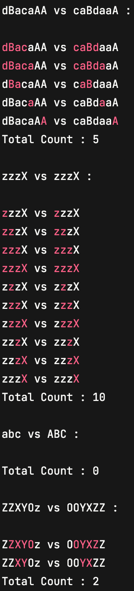

# All Anagrams starting from the same position in two Strings

## Description
There are two strings, A and B, each of length N. A fragment of string A Corresponds with a fragment of string B if: both fragments start at the same position; letters from one fragment can be rearranged into the order of letters in the other fragment (note that the case and number of occurrences of the letter matters).
For example, given A = "dBacaAA' andB "caBdaaA",fragment "Ba" starting at position 1 of string A corresponds with fragment "aB" starting at position 1 of string B. On the other hand, fragment "ca" at position 3 in A does not correspond to "ca" at position 0 in B as they start in different positions. Fragments "aAA and "aaA starting at position 4 of both strings do not correspond as the number of occurrences of letters 'a' and 'A in the fragments differ.
Write a function: int solution(string &A, string &B)
such that, given stringsA and B, each of lengthN, returns the number of corresponding fragments of A and B.

Examples :

Given A "dBacaAA" and B = "caBdaaA", the function should return 5. The corresponding fragments are:
"dBaca" and "caBda" (starting at position 0)
"dBac" and "caBd"(starting at position 0)
."Ba" and "aB" (starting at position 1)
."a" and "a" (starting at position 4)
. "A" and "A" (at position 6).

Given A = "zzzX" and B "zzzX",the function should return 10. All fragments starting at the same positions in both strings correspond.

Given A = "abc" and B "ABC',the function should return 0. Even though the fragments consist of the same letters, in string A they are lowercase and in string B they are uppercase.

Given A = "ZZXY0z" and B = "OOYXZZ", the function should return 2.

Assume that: N is an integer within the range[1..100]. strings A and B consist only of letters (a-z and/or A-Z).
In your solution, focus on correctness. The performance of your solution will not be the focus of the assessment. They mentioned it for both the questions.

