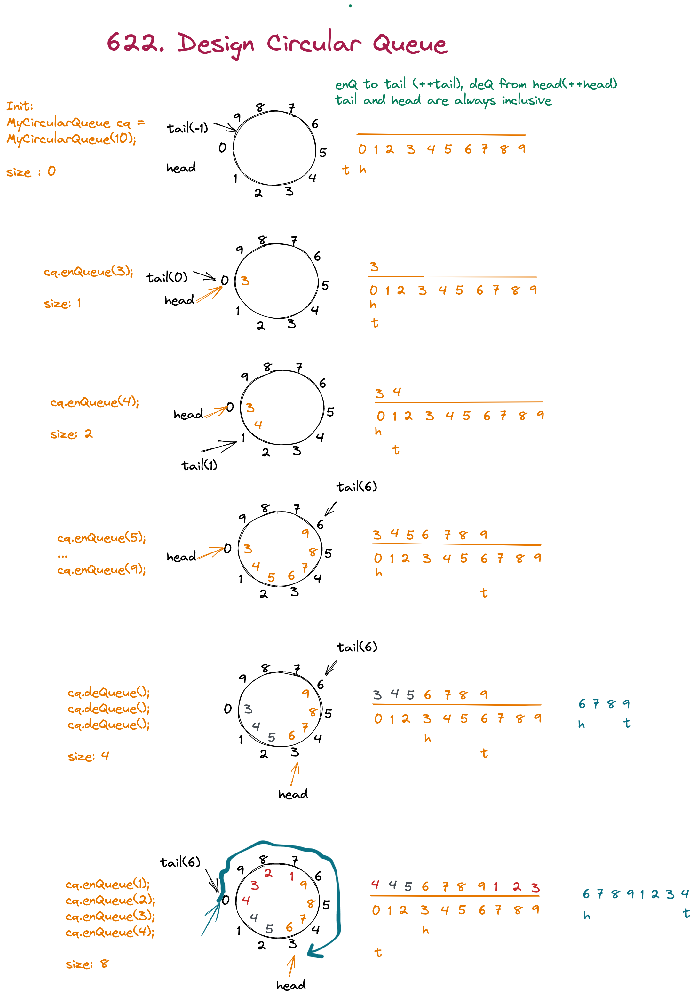

# [622. Design Circular Queue](https://leetcode.com/problems/design-circular-queue/submissions/)

## 思路
1. head, tail两个指针表示头尾
2. size 表示队列内元素个数
3. 按照Java queue interface的统一标准, tail入队, head出队
4. offer(enQueue): ++tail
5. poll(deQueue): ++head
6. 因为只需要但方向进出, 初始值: tail = -1, head = 0
   1. 第一次enQueue之后tail = head = 0, 这样直接Front() & Rear() 都能直接得到对应的值
### DEMO


### 3ms, 100%
```java
class MyCircularQueue {
    private int tail, head, size, n;
    private final int[] a;
    public MyCircularQueue(int k) {
        a = new int[k];
        tail = -1;
        n = k;
    }

    public boolean enQueue(int x) {
        if (size == n) return false;
        a[tail = ++tail % n] = x;
        size++;
        return true;
    }

    public boolean deQueue() {
        if (size == 0) return false;
        head = ++head % n;
        size--;
        return true;
    }

    public int Front() {
        return size == 0 ? -1 : a[head];
    }

    public int Rear() {
        return size == 0 ? -1 : a[tail];
    }

    public boolean isEmpty() {
        return size == 0;
    }

    public boolean isFull() {
        return size == n;
    }
}
```