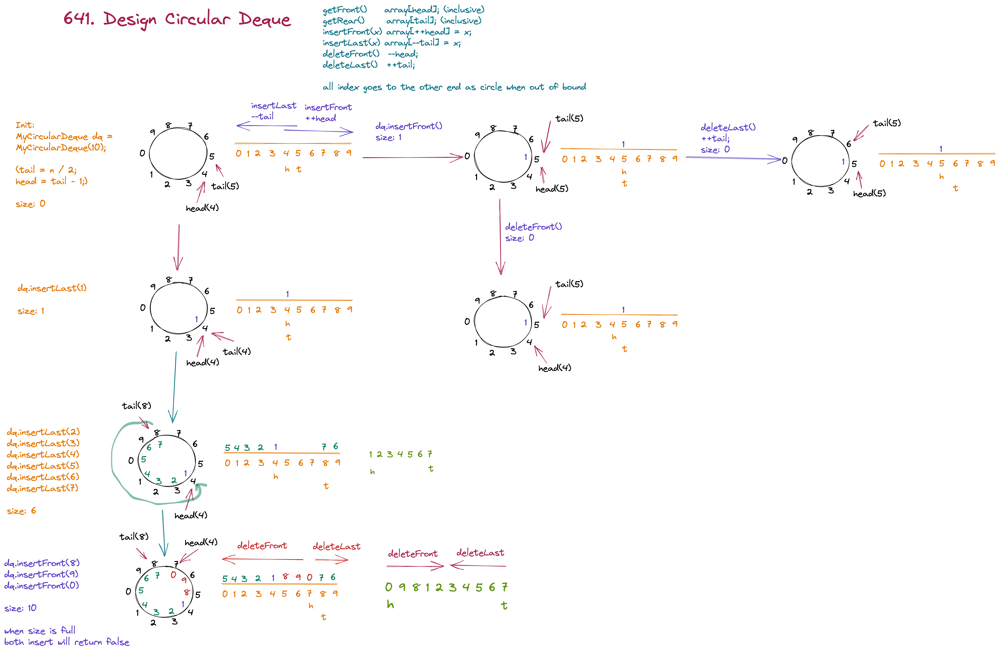

# [641. Design Circular Deque](https://leetcode.com/problems/design-circular-deque/)



1. head and tail denote index of front and rear of deque, size denotes elements in deque
2. both indices are inclusive, so that Rear() and Front() can get value directly from head and tail index without any manipulation. (provided size > 0, of course)
3. Very straight forward insert and delete:
4. ++head for insertFront() and --head for deleteFront()
5. --tail for insertLast() and ++tail for deleteLast()
6. For initialization, we put tail 1 position in front of head, why? see chart

```java
class MyCircularDeque {
    private int head, tail, size, n;
    private final int[] a;
    public MyCircularDeque(int k) {
        a = new int[k];
        n = a.length;
        tail = 1;
    }
    
    public boolean insertFront(int x) {
        if (size == n) return false;
        a[head = ++head % n] = x;
        size++;
        return true;
    }
    
    public boolean insertLast(int x) {
        if (size == n) return false;
        a[tail = (--tail + n) % n] = x;
        size++;
        return true;
    }
    
    public boolean deleteFront() {
        if (size == 0) return false;
        head = (--head + n) % n;
        size--;
        return true;
    }
    
    public boolean deleteLast() {
        if (size == 0) return false;
        tail = ++tail % n;
        size--;
        return true;
    }
    
    public int getFront() {
        return size == 0 ? -1 : a[head];
    }
    
    public int getRear() {
        return size == 0 ? -1 : a[tail];
    }
    
    public boolean isEmpty() {
        return size == 0;
    }
    
    public boolean isFull() {
        return size == a.length;
    }
}
```