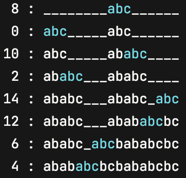

# [936. Stamping The Sequence](https://leetcode.com/problems/stamping-the-sequence/)

## solve it backwards
[3ms, 100%](https://leetcode.com/submissions/detail/766452643/)
```java
class Solution {
    public int[] movesToStamp(String stamp, String target) {
        char[] s = stamp.toCharArray();
        char[] t = target.toCharArray();
        int m = s.length, n = t.length, count = 0; // count chars replaced successfully

        boolean[] visited = new boolean[n];
        int[] res = new int[n];
        int top = res.length;
        while (count < n) {
            boolean stamped = false;
            for (int i = 0; i <= n - m; i++)
                if (!visited[i] && canStamp(i, s, t)) {
                    visited[i] = true;
                    // System.out.printf("%s%d\n%s\n%s%s\n\n", " ".repeat(i), i, new String(t), " ".repeat(i), new String(s));
                    count = stamp(i, s, t, count);
                    stamped = true; // successfully stamped this round
                    res[--top] = i; // add result
                    if (count == n) break; // all stamped
                }
            
            if (!stamped) return new int[0]; // nothing found, return an empty array
        }
        
        return Arrays.copyOfRange(res, top, res.length);
    }
    
    private int stamp(int start, char[] s, char[] t, int count) {
        for (int i = 0; i < s.length; i++)
            if (t[start + i] != '*') {
                t[start + i] = '*';
                count++;
            }
        
        return count;
    }
    
    private boolean canStamp(int start, char[] s, char[] t) {
        int count = 0;
        for (int i = 0; i < s.length; i++) {
            if (t[start + i] == '*') count++;
            else if (t[start + i] != '*' && s[i] != t[start + i])
                return false;
        }

        return count != s.length;
    }
}
```
### program execution sequence
<pre>
Case 0:
"abc"
"abababcbcbababcbc"

    4
abababcbcbababcbc
    abc

      6
abab***bcbababcbc
      abc

            12
abab*****bababcbc
            abc

              14
abab*****bab***bc
              abc

  2
abab*****bab*****
  abc

          10
ab*******bab*****
          abc

0
ab*******b*******
abc

        8
*********b*******
        abc


Case 1:
"abc"
"ababc"

  2
ababc
  abc
  
0
ab***
abc

"abca"
"aabcaca"

 1
aabcaca
 abca
 
   3
a****ca
   abca
   
0
a******
abca
</pre>

### Forward sequence demo
<pre>
 8 : ________abc______
 0 : abc_____abc______
10 : abc_____ababc____
 2 : ababc___ababc____
14 : ababc___ababc_abc
12 : ababc___abababcbc
 6 : ababc_abcbababcbc
 4 : abababcbcbababcbc
</pre>

### code for print above
```java
class Solution {
    public static final String CYAN = "\033[0;36m";    // CYAN
    public static final String RESET = "\033[0m";  // Text Reset
    private static void printStamp(String stamp, String target, int[] solution) {
        char[] s = stamp.toCharArray();
        char[] t = new char[target.length()];
        Arrays.fill(t, '_');

        String pre = null;
        for (int x : solution) {
            System.arraycopy(s, 0, t, x, s.length);
            String t2 = new String(t);
            System.out.printf("%2d : %s", x, withColor(t, x, x + s.length - 1));
            if (t2.equals(pre)) System.out.println("(Dup Steps)");
            else System.out.println();
            pre = t2;
        }
    }

    private static String withColor(char[] t, int from, int to) {
        StringBuilder sb = new StringBuilder();
        for (int i = 0; i < t.length; i++) {
            if (i == from) sb.append(CYAN);
            sb.append(t[i]);
            if (i == to) sb.append(RESET);
        }
        return sb.toString();
    }

    public static void main(String[] args) {
        printStamp("abc", "abababcbcbababcbc", new int[] {8,0,10,2,14,12,6,4});
    }
}
```