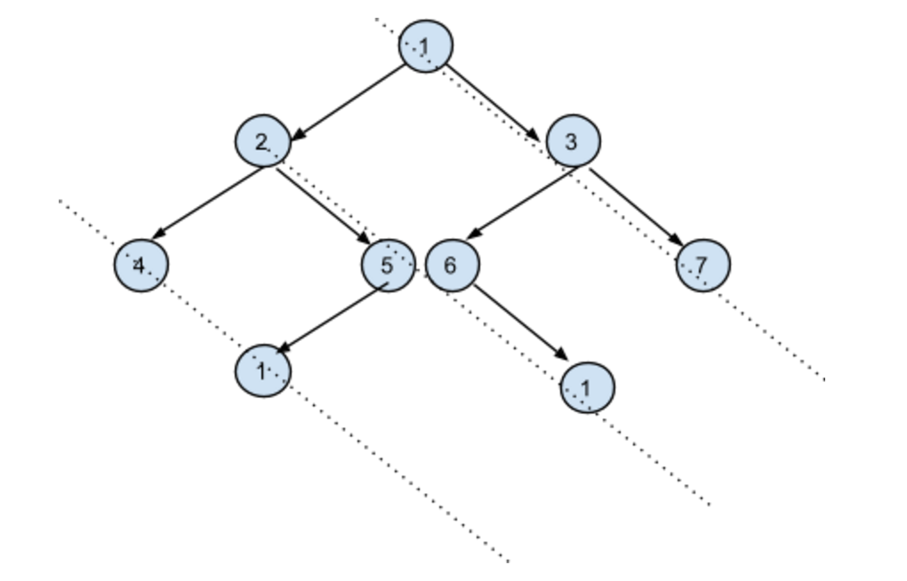

# Table of Content
1. [366. Find Leaves of Binary Tree](#366-Find-Leaves-of-Binary-Tree)
2. [199. Binary Tree Right Side View](#199-Binary-Tree-Right-Side-View)
   1. [LaiCode 296. Right View Of Binary Tree](#296-Right-View-Of-Binary-Tree)
   2. [LaiCode 297. Top View Of Binary Tree](#297-Top-View-Of-Binary-Tree)
3. [545. Boundary of Binary Tree](#545-Boundary-of-Binary-Tree)
4. [987. Vertical Order Traversal of a Binary Tree](#987-Vertical-Order-Traversal-of-a-Binary-Tree)
   1. [298-Vertical-List-Of-Binary-Tree](#298-Vertical-List-Of-Binary-Tree)
   2. [LaiCode 426. Binary Tree Vertical Order Traversal](#426-Binary-Tree-Vertical-Order-Traversal)
5. [LaiCode 406. Diagonal Sum of a Binary Tree](#406-Diagonal-Sum-of-a-Binary-Tree)

# Quick Note
This series is pretty much about assign coordinates to each node in Binary Tree,
x coordinate is the level/depth of each node and
y coordinate decrease by 1 when go left, increase by 1 when go right

# [366-Find-Leaves-of-Binary-Tree](https://leetcode.com/problems/find-leaves-of-binary-tree/)
TC: O(n) traverse the tree once, SC: O(h), height of tree, on call stack

The problem says to remove leaf nodes, you don't really need to do that to get the final result.

This problem eventually is to count level from bottom (leaf) level as index of result list
```java
/**
 * Definition for a binary tree node.
 * public class TreeNode {
 *     int val;
 *     TreeNode left;
 *     TreeNode right;
 *     TreeNode() {}
 *     TreeNode(int val) { this.val = val; }
 *     TreeNode(int val, TreeNode left, TreeNode right) {
 *         this.val = val;
 *         this.left = left;
 *         this.right = right;
 *     }
 * }
 */
class Solution {
    public List<List<Integer>> findLeaves(TreeNode root) {
        List<List<Integer>> res = new ArrayList<>();
        dfs(root, res);
        return res;
    }
    
    private int dfs(TreeNode root, List<List<Integer>> res) {
        if (root == null) return 0;
        int lvl = 1;
        lvl += Math.max(dfs(root.left, res), dfs(root.right, res));
        if (lvl-1 == res.size()) res.add(new ArrayList<>());
        res.get(lvl-1).add(root.val);
        // root.left = root.right = null;
        return lvl;
    }
}
```
# [199-Binary-Tree-Right-Side-View](https://leetcode.com/problems/binary-tree-right-side-view/)
[296-Right-View-Of-Binary-Tree](https://app.laicode.io/app/problem/296)
#### TC: O(n)/SC: O(height)
```java
class Solution {
    public List<Integer> rightSideView(TreeNode root) {
        List<Integer> res = new ArrayList<>();
        dfs(root, 0, res);
        return res;
    }
    private void dfs(TreeNode root, int lvl, List<Integer> res) {
        if (root == null) return; // base case

        // at cur level: check if it's the 1st node from right 
        if (res.size() == lvl) res.add(root.val);

        dfs(root.right, lvl + 1, res); // must go right first
        dfs(root.left , lvl + 1, res);
    }
}
```
# 297-Top-View-Of-Binary-Tree
[LaiCode 297. Top View Of Binary Tree](https://app.laicode.io/app/problem/297)
## Description
Given a binary tree, get the top view of it. The nodes in the output list should be from left to right. A node x belongs to the output if x is the topmost node at its column.

Examples:
<pre>
     1
   /   \
  2     3
 / \   / \
4  (5,6)  7
</pre>
the top view is [4, 2, 1, 3, 7]

#### 这题有点无聊
<pre>
                       6                        
            /                      \            
           2                       7            
      /          \            /          \      
     x           4           8           x      
   /    \      /    \      /    \      /    \   
  x     x     x     1     9     x     x     x   
 /  \  /  \  /  \  /  \  /  \  /  \  /  \  /  \ 
 x  x  x  x  x  x  x  5 10  x  x  x  x  x  x  x 
</pre>
预期结果是: [10, 2, 6, 7, 5] (想象一下坐标)
## TC & SC
TC: O(n)

SC: O(height)

```java
class Solution {
  int min = 0, max = -1;

  static class Pair {
      TreeNode node;
      int idx;
      Pair(TreeNode node, int idx) {
          this.node = node;
          this.idx = idx;
      }
  }

  public List<Integer> topView(TreeNode root) {
    Map<Integer, Integer> map = new HashMap<>();

    Queue<Pair> q = new ArrayDeque<>();
    if (root != null) q.offer(new Pair(root, 0));

    while (!q.isEmpty()) {
        Pair cur = q.poll();
        min = Math.min(min, cur.idx);
        max = Math.max(max, cur.idx);

        if (!map.containsKey(cur.idx)) map.put(cur.idx, cur.node.key);

        if (cur.node.left  != null) q.offer(new Pair(cur.node.left , cur.idx - 1));
        if (cur.node.right != null) q.offer(new Pair(cur.node.right, cur.idx + 1));
    }
    
    List<Integer> res = new ArrayList<>();
    for (int i = min; i <= max; i++) res.add(map.get(i));
    return res;
  }
}
```
# [545-Boundary-of-Binary-Tree](https://leetcode.com/problems/boundary-of-binary-tree/)
same as [316. Border View Of Binary Tree](https://app.laicode.io/app/problem/316)
```java
class Solution {
    public List<Integer> boundaryOfBinaryTree(TreeNode root) {
        List<Integer> res = new ArrayList<>();
        if (root == null) return res;
        res.add(root.val);
        if (root.left != null) leftBorder(root.left, res);
        if (root.left != null || root.right != null) leafs(root, res);
        if (root.right != null) rightBorder(root.right, res);
        return res;
    }

    private void leftBorder(TreeNode root, List<Integer> res) {
        if (root.left != null) {
            res.add(root.val);
            leftBorder(root.left, res);
        } else if (root.right != null) {
            res.add(root.val);
            leftBorder(root.right, res);
        }
    }

    private void rightBorder(TreeNode root, List<Integer> res) {
        if (root.right != null) {
            rightBorder(root.right, res);
            res.add(root.val);
        } else if (root.left != null) {
            rightBorder(root.left, res);
            res.add(root.val);
        }
    }

    private void leafs(TreeNode root, List<Integer> res) {
        if (root.left == null && root.right == null) res.add(root.val);
        
        if (root.left != null) leafs(root.left, res);
        if (root.right != null) leafs(root.right, res);
    }
}
```
# [987-Vertical-Order-Traversal-of-a-Binary-Tree](https://leetcode.com/problems/vertical-order-traversal-of-a-binary-tree/)
# [298-Vertical-List-Of-Binary-Tree](https://app.laicode.io/app/problem/298)
## Description
Given a binary tree, get the vertical representation of it as a list of lists.

The columns should be from left to right, and for each column the nodes should be placed from top to bottom, from left to right.

The following example illustrates vertical order traversal. Input:
<pre>

            1
          /   \
         2     3
        /  \  / \
       4   5,6   7
             \     \
              8     9  
</pre>

Output:

<pre>
[[4],         // left most column
[2],         // 2nd left-most column
[1, 5, 6], // 3rd left-most column, top->bottom, left->right
[3, 8],
[7],
[9]]
</pre>
### TC: O(n)/SC: O(height)
```java
class Solution {
    static class Pair {
        TreeNode node;
        int idx;
        Pair(TreeNode node, int idx) {
            this.node = node;
            this.idx = idx;
        }
    }
    public List<List<Integer>> verticalPrint(TreeNode root) {
        Map<Integer, List<Integer>> map = new HashMap<>();
        int[] range = bfs(root, map);

        List<List<Integer>> res = new ArrayList<>(range[1] - range[0] + 1);

        for (int i = range[0]; i <= range[1]; i++) res.add(map.get(i));

        return res;
    }

    private int[] bfs(TreeNode root, Map<Integer, List<Integer>> map) {
        Queue<Pair> q = new ArrayDeque<>();
        if (root != null) q.offer(new Pair(root, 0));

        int min = 0, max = -1; // so that size (max - min + 1) is 0 when root is null

        while (!q.isEmpty()) {
            Pair cur = q.poll();
            min = Math.min(min, cur.idx);
            max = Math.max(max, cur.idx);

            List<Integer> list = map.getOrDefault(cur.idx, new ArrayList<>());
            list.add(cur.node.key);
            map.put(cur.idx, list);

            if (cur.node.left  != null) q.offer(new Pair(cur.node.left , cur.idx - 1));
            if (cur.node.right != null) q.offer(new Pair(cur.node.right, cur.idx + 1));
        }

        return new int[] {min, max};
    }
}
```
## [426-Binary-Tree-Vertical-Order-Traversal](https://app.laicode.io/app/problem/426)
### Code
The only difference between 426 and 298, pls refer to that code with below notes
```
for (int i = range[0]; i <= range[1]; i++) res.add(map.get(i));
vs
for (int i = range[0]; i <= range[1]; i++) res.addAll(map.get(i));
```
# [406-Diagonal-Sum-of-a-Binary-Tree](https://app.laicode.io/app/problem/406)
## Description

Diagonal sum in a binary tree is the sum of all the node’s data lying through the dashed lines. Given a Binary Tree, print all diagonal sums.

For the above input tree, output should be:

{ 11, 14, 5 }


## Analysis
<pre>
right most: 0,0, 1,1, 2,2
2nd diag: 1,-1, 2,0, 2,0, 3,1
3rd diag: 2,-2, 3,-1

let lvl(depth) be row #
for col #: let root be col 0, if we go left col -1, if we go right col +1
for first dashed line (right, top): row - col = 0
for 2nd dashed line: row - col = 2
3rd: row - col = 4
if we use a list to save the sum results for all, (row - col)/2 will be the index
</pre>
## TC & SC
TC: O(n)

SC: O(height)

```java
class Solution {
  public List<Integer> diagonalSum(TreeNode root) {
    List<Integer> res = new ArrayList<>();
    dfs(root, 0, 0, res);
    return res;
  }
  
    private void dfs(TreeNode root, int lvl, int col, List<Integer> res) {
    if (root == null) return;
    int idx = (lvl - col) / 2;
    if (res.size() == idx) res.add(root.key);
    else res.set(idx, root.key + res.get(idx));
    dfs(root.left , lvl + 1, col - 1, res);
    dfs(root.right, lvl + 1, col + 1, res);
  }
}
```
