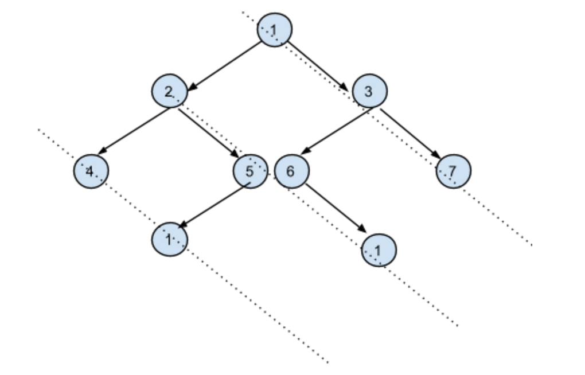

# Table of Content
[LaiCode 296. Right View Of Binary Tree](#296-Right-View-Of-Binary-Tree)
[LaiCode 297. Top View Of Binary Tree](#297-Top-View-Of-Binary-Tree)
[LaiCode 298. Vertical List Of Binary Tree](#298-Vertical-List-Of-Binary-Tree)
[LaiCode 426. Binary Tree Vertical Order Traversal](#426-Binary-Tree-Vertical-Order-Traversal)

# 296-Right-View-Of-Binary-Tree
[LaiCode 296. Right View Of Binary Tree](https://app.laicode.io/app/problem/296)
## Description
Given a Binary Tree, return the right view of it. Right view of a Binary Tree is list of nodes visible when tree is visited from Right side, the order of the nodes in the list should be from top to bottom level of the original tree.

Examples:
<pre>
         1
       /    \
      2      3
     / \    /  \
    4   5   6   7
   /             \
  9               8
 /  \
10  11
</pre>
the right view =  [1, 3, 7, 8, 11]

## TC & SC
TC: O(n)

SC: O(height)

```java
class Solution {
  public List<Integer> rightView(TreeNode root) {
    List<Integer> res = new ArrayList<>();
    if (root != null) dfs(root, res, 0);
    return res;
  }

  private void dfs(TreeNode root, List<Integer> res, int lvl) {
    if (lvl == res.size()) res.add(root.key);
    if (root.right != null) dfs(root.right, res, lvl + 1);
    if (root.left  != null) dfs(root.left , res, lvl + 1);
  }
}
```
# 297-Top-View-Of-Binary-Tree
[LaiCode 297. Top View Of Binary Tree](https://app.laicode.io/app/problem/297)
## TC & SC
TC: O(n)

SC: O(height)

```java
class Solution {
  int min = 0, max = -1;

  static class Pair {
      TreeNode node;
      int idx;
      Pair(TreeNode node, int idx) {
          this.node = node;
          this.idx = idx;
      }
  }

  public List<Integer> topView(TreeNode root) {
    Map<Integer, Integer> map = new HashMap<>();

    Queue<Pair> q = new ArrayDeque<>();
    if (root != null) q.offer(new Pair(root, 0));

    while (!q.isEmpty()) {
        Pair cur = q.poll();
        min = Math.min(min, cur.idx);
        max = Math.max(max, cur.idx);

        if (!map.containsKey(cur.idx)) map.put(cur.idx, cur.node.key);

        if (cur.node.left  != null) q.offer(new Pair(cur.node.left , cur.idx - 1));
        if (cur.node.right != null) q.offer(new Pair(cur.node.right, cur.idx + 1));
    }
    
    List<Integer> res = new ArrayList<>();
    for (int i = min; i <= max; i++) res.add(map.get(i));
    return res;
  }
}
```
# 298-Vertical-List-Of-Binary-Tree
[LaiCode 298. Vertical List Of Binary Tree](https://app.laicode.io/app/problem/298)

## TC & SC
TC: O(n)

SC: O(height)

```java
class Solution {

    static class Pair {
        TreeNode node;
        int idx;
        Pair(TreeNode node, int idx) {
            this.node = node;
            this.idx = idx;
        }
    }
    public List<List<Integer>> verticalPrint(TreeNode root) {
        Map<Integer, List<Integer>> map = new HashMap<>();
        int[] range = bfs(root, map);

        List<List<Integer>> res = new ArrayList<>(range[1] - range[0] + 1);

        for (int i = range[0]; i <= range[1]; i++) res.add(map.get(i));

        return res;
    }

    private int[] bfs(TreeNode root, Map<Integer, List<Integer>> map) {
        Queue<Pair> q = new ArrayDeque<>();
        if (root != null) q.offer(new Pair(root, 0));

        int min = 0, max = -1; // so that size (max - min + 1) is 0 when root is null

        while (!q.isEmpty()) {
            Pair cur = q.poll();
            min = Math.min(min, cur.idx);
            max = Math.max(max, cur.idx);

            List<Integer> list = map.getOrDefault(cur.idx, new ArrayList<>());
            list.add(cur.node.key);
            map.put(cur.idx, list);

            if (cur.node.left  != null) q.offer(new Pair(cur.node.left , cur.idx - 1));
            if (cur.node.right != null) q.offer(new Pair(cur.node.right, cur.idx + 1));
        }

        return new int[] {min, max};
    }

}
```
# 426-Binary-Tree-Vertical-Order-Traversal
[LaiCode 426. Binary Tree Vertical Order Traversal](https://app.laicode.io/app/problem/426)

## Description
Given a binary tree, return the vertical order traversal of its nodes' values. (ie, from top to bottom, column by column).

If two nodes are in the same row and column, the order should be from left to right.

Examples:
Given binary tree [3,9,20,null,null,15,7],
<pre>
   3
  /\
 /  \
 9  20
    /\
   /  \
  15   7
</pre>
return its vertical order traversal as:
[9,3,15,20,7]

Given binary tree [3,9,8,4,0,1,7],
<pre>
    3
   /\
  /  \
  9   8
 /\  /\
/  \/  \
4  01   7
</pre>
return its vertical order traversal as:
[4,9,3,0,1,8,7]

Given binary tree [3,9,8,4,0,1,7,null,null,null,2,5] (0's right child is 2 and 1's left child is 5),
<pre>
  3
  /\
 /  \
 9   8
 /\  /\
/  \/  \
4  01   7
   /\
  /  \
  5   2
</pre>

return its vertical order traversal as:

[4,9,5,3,0,1,8,2,7]

## TC & SC
TC: O(n)

SC: O(height)

```java

```
# 406-Diagonal-Sum-of-a-Binary-Tree
[LaiCode 406. Diagonal Sum of a Binary Tree](https://app.laicode.io/app/problem/406)
## Description

Diagonal sum in a binary tree is the sum of all the node’s data lying through the dashed lines. Given a Binary Tree, print all diagonal sums.

For the above input tree, output should be:

{ 11, 14, 5 }


## Analysis
right most: 0,0, 1,1, 2,2
2nd diag: 1,-1, 2,0, 2,0, 3,1
3rd diag: 2,-2, 3,-1

<pre>
let lvl(depth) be row #
for col #: let root be col 0, if we go left col -1, if we go right col +1
for first dashed line (right, top): row - col = 0
for 2nd dashed line: row - col = 2
3rd: row - col = 4
if we use a list to save the sum results for all, (row - col)/2 will be the index
</pre>
## TC & SC
TC: O(n)

SC: O(height)

```java
class Solution {
  public List<Integer> diagonalSum(TreeNode root) {
    List<Integer> res = new ArrayList<>();
    dfs(root, 0, 0, res);
    return res;
  }
  
    private void dfs(TreeNode root, int lvl, int col, List<Integer> res) {
    if (root == null) return;
    int idx = (lvl - col) / 2;
    if (res.size() == idx) res.add(root.key);
    else res.set(idx, root.key + res.get(idx));
    dfs(root.left , lvl + 1, col - 1, res);
    dfs(root.right, lvl + 1, col + 1, res);
  }
}
```